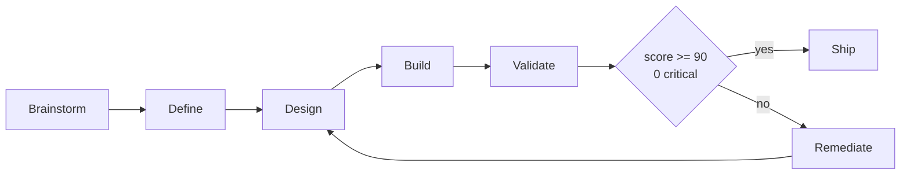

# AgentSpec

> validated development workflow with Agent Matching and Delegation, specialized for Data Engineering.
> *"Brainstorm -> Define -> Design -> Build -> Validate -> Ship"*

---

## Overview

AgentSpec provides Agent Matching (Design phase) and Agent Delegation (Build phase):

| Traditional Approach | AgentSpec |
|---------------|--------------|
| 8 phases | **validated phases** (Brainstorm optional) |
| 3 development modes | **1 unified stream** |
| Generic agents only | **62 specialized agents** across 8 categories |
| No domain expertise | **26 KB domains** for data engineering |
| 12+ commands | **folder-invoked command skills** |
| 11+ artifact types | **validated SDD artifacts** |
| Separate ADR files | **Inline decisions** |
| Pre-generated tasks | **On-the-fly execution** |

---

## The Validated Pipeline



---

## Commands

### SDD Workflow (7)

| Command | Phase | Purpose | Model |
|---------|-------|---------|-------|
| `/brainstorm` | 0 | Explore ideas through collaborative dialogue | Opus |
| `/define` | 1 | Capture and validate requirements | Opus |
| `/design` | 2 | Create architecture and specification | Opus |
| `/build` | 3 | Execute implementation with verification | Sonnet |
| `/validate` | 3.5 | Validate implementation before Ship | Sonnet |
| `/ship` | 4 | Archive with lessons learned | Haiku |
| `/iterate` | Any | Update documents when changes needed | Sonnet |
| `/create-pr` | -- | Create pull request | -- |

### Data Engineering (8)

| Command | Purpose |
|---------|---------|
| `/pipeline` | DAG/pipeline scaffolding |
| `/schema` | Interactive schema design |
| `/data-quality` | Quality rules generation |
| `/lakehouse` | Table format + catalog guidance |
| `/sql-review` | SQL-specific code review |
| `/ai-pipeline` | RAG/embedding scaffolding |
| `/data-contract` | Contract authoring (ODCS) |
| `/migrate` | Legacy ETL migration |

### Core & Utilities (6)

| Command | Purpose |
|---------|---------|
| `/create-kb` | Create KB domain |
| `/review` | Code review |
| `/meeting` | Meeting transcript analysis |
| `/memory` | Save session insights |
| `/sync-context` | Update CLAUDE.md |
| `/readme-maker` | Generate README |

---

## Artifacts

| Artifact | Phase | Location |
|----------|-------|----------|
| `BRAINSTORM_{FEATURE}.md` | 0 | `.github/sdd/features/` |
| `DEFINE_{FEATURE}.md` | 1 | `.github/sdd/features/` |
| `DESIGN_{FEATURE}.md` | 2 | `.github/sdd/features/` |
| `BUILD_REPORT_{FEATURE}.md` | 3 | `.github/sdd/features/{feature-name}/` |
| `VALIDATION_REPORT_{FEATURE}.md` | 3.5 | `.github/sdd/features/{feature-name}/` |
| `RUNBOOK_{FEATURE}.md` | 3.5 | `.github/sdd/features/{feature-name}/` |
| `ROADMAP_{FEATURE}.md` | 3.5 | `.github/sdd/features/{feature-name}/` |
| `SHIPPED_{DATE}.md` | 4 | `.github/sdd/archive/{feature-name}/` |

---

## Quick Start

### Data Engineering Feature (Full Pipeline)

```bash
# Phase 0: Explore the idea (optional)
/workflow-commands /brainstorm "Build an incremental orders pipeline with SCD Type 2"

# Phase 1: Define requirements (from brainstorm output)
/workflow-commands /define .github/sdd/features/orders-pipeline/BRAINSTORM_ORDERS_PIPELINE.md

# Phase 2: Create technical design
/workflow-commands /design .github/sdd/features/orders-pipeline/DEFINE_ORDERS_PIPELINE.md

# Phase 3: Build the code
/workflow-commands /build .github/sdd/features/orders-pipeline/DESIGN_ORDERS_PIPELINE.md

# Phase 3.5: Validate before ship
/workflow-commands /validate .github/sdd/features/orders-pipeline/BUILD_REPORT_ORDERS_PIPELINE.md

# Phase 4: Archive when validation is approved
/workflow-commands /ship .github/sdd/features/orders-pipeline/DEFINE_ORDERS_PIPELINE.md
```

### DE-Specific Commands (Skip SDD)

```bash
# Design a star schema
/schema "Star schema for e-commerce analytics"

# Scaffold a pipeline
/pipeline "Daily orders ETL from Postgres to Snowflake"

# Generate quality checks
/data-quality models/staging/stg_orders.sql
```

### Making Changes Mid-Stream

```bash
# Update DEFINE with new requirement
/iterate DEFINE_ORDERS_PIPELINE.md "Add support for late-arriving facts"

# Update DESIGN with architecture change
/iterate DESIGN_ORDERS_PIPELINE.md "Switch to incremental strategy"
```

---

## Folder Structure

```text
.github/sdd/
+-- _index.md                    # This file (workflow overview)
+-- README.md                    # Comprehensive documentation
+-- features/                    # Active feature documents
|   +-- BRAINSTORM_{FEATURE}.md
|   +-- DEFINE_{FEATURE}.md
|   +-- DESIGN_{FEATURE}.md
+-- reports/                     # Build reports
|   +-- BUILD_REPORT_{FEATURE}.md
+-- archive/                     # Shipped features
|   +-- {FEATURE}/
|       +-- BRAINSTORM_{FEATURE}.md  (if used)
|       +-- DEFINE_{FEATURE}.md
|       +-- DESIGN_{FEATURE}.md
|       +-- BUILD_REPORT_{FEATURE}.md
|       +-- SHIPPED_{DATE}.md
+-- templates/                   # Document templates
|   +-- BRAINSTORM_TEMPLATE.md
|   +-- DEFINE_TEMPLATE.md
|   +-- DESIGN_TEMPLATE.md
|   +-- BUILD_REPORT_TEMPLATE.md
|   +-- SHIPPED_TEMPLATE.md
+-- architecture/                # Workflow contracts
    +-- WORKFLOW_CONTRACTS.yaml
    +-- ARCHITECTURE.md
```

---

## Phase Details

### Phase 0: Brainstorm (Optional)

**Purpose:** Explore ideas through collaborative dialogue before capturing requirements.

**When to Use:**
- Vague idea that needs exploration
- Multiple possible approaches to consider
- Uncertain about scope or users
- Need to apply YAGNI before diving in

**When to Skip:**
- Clear requirements already known
- Meeting notes with explicit asks
- Simple feature request

**Input:** Raw idea, problem statement, or vague request.

**Output:** `BRAINSTORM_{FEATURE}.md` with:
- Discovery questions and answers
- 2-3 approaches explored with trade-offs
- Selected approach with reasoning
- Features removed (YAGNI applied)
- Draft requirements for /define

**Quality Gate:** Min 3 questions, 2+ approaches, 2+ validations, user confirmed

### Phase 1: Define

**Purpose:** Capture and validate requirements from any input.

**Input:** BRAINSTORM document, raw notes, emails, conversations, or direct requirements.

**Output:** `DEFINE_{FEATURE}.md` with:
- Problem statement
- Target users
- Success criteria (measurable)
- Acceptance tests (Given/When/Then)
- Technical Context (deployment location, KB domains, data lineage)
- Out of scope

**Quality Gate:** Clarity Score >= 12/15

### Phase 2: Design

**Purpose:** Create complete technical design with inline decisions.

**Input:** `DEFINE_{FEATURE}.md`

**Output:** `DESIGN_{FEATURE}.md` with:
- Architecture diagram (ASCII)
- Key decisions with rationale
- File manifest with agent assignments
- Code patterns (copy-paste ready)
- Testing strategy

**Quality Gate:** Complete file manifest, all files have agents, no shared dependencies

### Phase 3: Build

**Purpose:** Execute implementation following the design with agent delegation.

**Input:** `DESIGN_{FEATURE}.md`

**Output:**
- Code files (as specified in manifest)
- `BUILD_REPORT_{FEATURE}.md` with agent attribution

**Quality Gate:** All tasks complete, all tests pass

### Phase 4: Ship

**Purpose:** Archive completed feature with lessons learned.

**Input:** All feature artifacts

**Output:**
- `archive/{FEATURE}/` folder with all documents
- `SHIPPED_{DATE}.md` with lessons learned

---

## Key Principles

| Principle | Application |
|-----------|-------------|
| **Single Stream** | No mode switching, one unified workflow |
| **Inline Decisions** | ADRs in DESIGN document, not separate files |
| **On-the-Fly Tasks** | Tasks generated from file manifest during build |
| **Self-Contained** | Each deployable unit works independently |
| **Config Over Code** | Use YAML for configuration, not hardcoded values |
| **Iterate Anywhere** | Changes can be made at any phase via `/iterate` |
| **Data Engineering First** | Pipelines, schemas, and quality are built-in concerns |

---

## Model Assignment

| Phase | Model | Rationale |
|-------|-------|-----------|
| Brainstorm | Opus | Creative thinking and nuanced dialogue |
| Define | Opus | Nuanced understanding of requirements |
| Design | Opus | Architectural decisions require depth |
| Build | Sonnet | Fast, accurate code generation |
| Ship | Haiku | Simple archival operations |
| Iterate | Sonnet | Balanced speed and understanding |

---

## References

| Resource | Location |
|----------|----------|
| SDD Commands | `.github/commands/workflow/` |
| DE Commands | `.github/commands/data-engineering/` |
| Core Commands | `.github/commands/core/` |
| Agents (62 + DEFAULT) | `.github/agents/` |
| KB Domains (26) | `.github/kb/` |
| Templates | `.github/sdd/templates/` |
| Contracts | `.github/sdd/architecture/WORKFLOW_CONTRACTS.yaml` |

---

## Version History

| Version | Date | Changes |
|---------|------|---------|
| 2.1.0 | 2026-03-26 | Multi-cloud coverage: 62 agents, 8 categories, 26 KB domains |
| 2.0.0 | 2026-03-26 | Data engineering pivot: 11 KB domains, 11 DE agents, 8 DE commands |
| 1.0.0 | 2026-02-17 | Public release as AgentSpec v1.0.0 |
