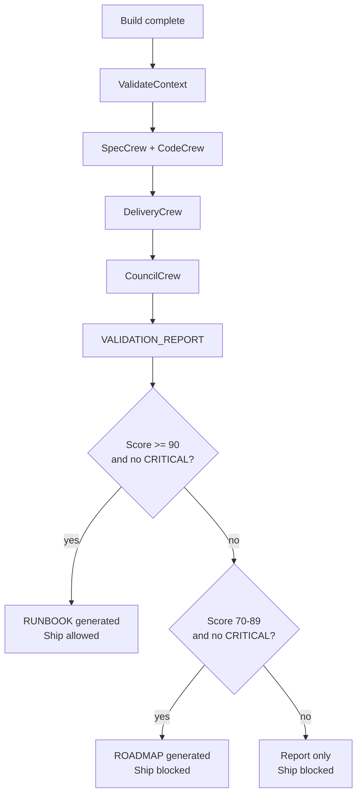

# Validate Skill

`/validate` is the AgentSpec SDD Phase 3.5 quality gate. It runs after `/workflow-commands /build` and before `/workflow-commands /ship`.

## Purpose

Build confirms that implementation work was executed. Validate confirms that the implementation still matches the DEFINE requirements, DESIGN intent, build evidence, code quality expectations, and production readiness bar.

Ship must not archive a feature until validation has produced a passing `VALIDATION_REPORT_{FEATURE}.md`.

## Invocation

Preferred workflow invocation:

```text
/workflow-commands /validate .github/sdd/features/{feature-name}/BUILD_REPORT_{FEATURE}.md
```

Direct runtime invocation:

```bash
python3 .github/skills/validate/scripts/main.py FEATURE_NAME
```

## Inputs

| Input | Required |
|---|---|
| `.github/sdd/features/{feature-name}/DEFINE_{FEATURE}.md` | Yes |
| `.github/sdd/features/{feature-name}/DESIGN_{FEATURE}.md` | Yes |
| `.github/sdd/features/{feature-name}/BUILD_REPORT_{FEATURE}.md` | Yes |
| `projects/{feature-name}/` implementation tree | Yes |
| `.github/sdd/features/{feature-name}/BRAINSTORM_{FEATURE}.md` | Optional |

## Outputs

| Artifact | Condition |
|---|---|
| `VALIDATION_REPORT_{FEATURE}.md` | Always generated |
| `RUNBOOK_{FEATURE}.md` | Score >= 90 and no CRITICAL findings |
| `ROADMAP_{FEATURE}.md` | Score 70-89 and no CRITICAL findings |

## Gate



