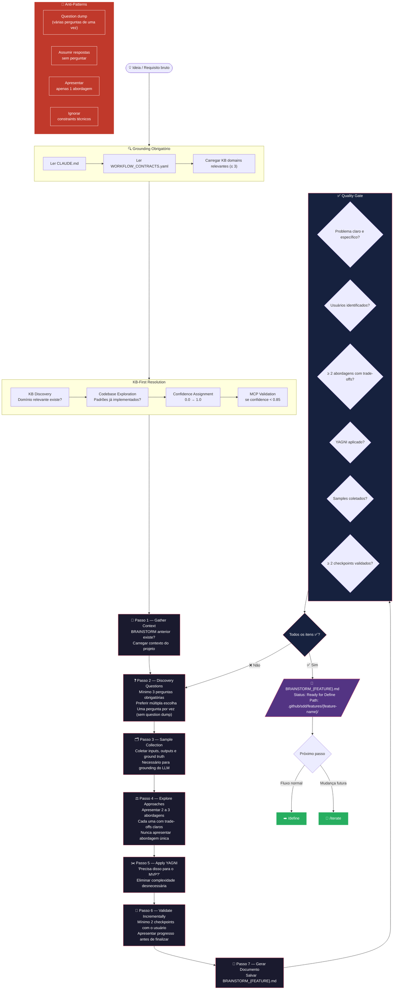

# Fase 0 — BRAINSTORM

## Regras Rápidas

| # | Regra |
|---|---|
| 1 | Mínimo **3 perguntas** de discovery |
| 2 | Sempre **múltipla escolha** nas perguntas |
| 3 | Apresentar **2–3 abordagens** com trade-offs |
| 4 | Aplicar **YAGNI** — cortar o que não é MVP |
| 5 | **≥ 2 checkpoints** de validação com o usuário |
| 6 | Confidence threshold: **0.85** |
| 7 | Nunca fazer question dump — **uma pergunta por vez** |
