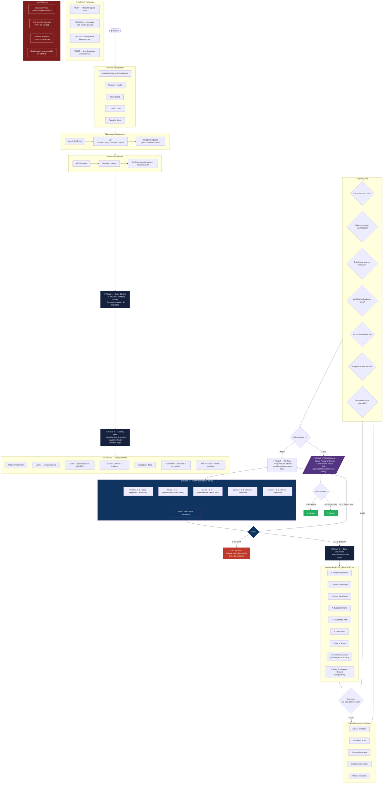

# Fase 1 — DEFINE

## Regras Rápidas

| # | Regra |
|---|---|
| 1 | **Clarity Score mínimo: 12/15** para avançar |
| 2 | Score 9–11: preencher gaps antes de continuar |
| 3 | Score 0–8: **bloqueado**, coletar mais info |
| 4 | Todos os goals devem ter **MoSCoW** |
| 5 | Success Criteria devem ser **testáveis** |
| 6 | Out of Scope deve ser **explícito** |
| 7 | `/design` **não pode começar** sem este documento |
| 8 | Confidence threshold: **0.90** |

## Clarity Score — Guia de Pontuação

| Elemento | 0 | 1 | 2 | 3 |
|---|---|---|---|---|
| Problem | Ausente | Vago | Específico | Claro + acionável |
| Users | Ausente | Genérico | Identificados | Com pain points |
| Goals | Ausente | Vagos | Mensuráveis | MoSCoW aplicado |
| Success | Ausente | Subjetivos | Objetivos | Testáveis automaticamente |
| Scope | Ausente | Implícito | Parcial | In/out explícito |
