# Fase 2 — DESIGN

```mermaid
flowchart TD
    START(["📄 DEFINE_{FEATURE}.md"])

    START --> MANDATORY_GATE{"🔒 GATE OBRIGATÓRIO
    DEFINE_{FEATURE}.md existe?"}

    MANDATORY_GATE -->|"❌ NÃO"| BLOCK["⛔ BLOQUEADO
    Execute /define primeiro"]

    MANDATORY_GATE -->|"✅ SIM"| G

    subgraph G["🔍 Grounding Obrigatório"]
        G1["Ler CLAUDE.md"] --> G2["Ler WORKFLOW_CONTRACTS.yaml"]
        G2 --> G3["Carregar routing.json"]
    end

    G --> KB

    subgraph KB["KB-First Resolution — threshold: 0.95"]
        KB1["1. KB Pattern Loading\n(padrões relevantes ao domínio)"]
        KB2["2. Agent Discovery\n(routing.json — agente por tipo)"]
        KB3["3. Confidence Assignment"]
        KB4["4. MCP Validation\nse confidence < 0.95"]
        KB1 --> KB2 --> KB3 --> KB4
    end

    KB --> S1

    S1["📂 Passo 1 — Load Context
    Ler DEFINE_{FEATURE}.md completo
    Carregar KB domains do problema
    Mapear dependências existentes"]

    S1 --> S2

    S2["🏛️ Passo 2 — Create Architecture
    Diagrama ASCII obrigatório
    Decisões de componentes justificadas
    Stack tecnológica com razões
    Estratégia de integração"]

    S2 --> ADR

    subgraph ADR["📝 Passo 3 — Inline ADR (uma por decisão crítica)"]
        direction TB
        ADR1["Status:               Proposed | Accepted | Deprecated | Superseded"]
        ADR2["Date:                 YYYY-MM-DD"]
        ADR3["Context:              situação que força a decisão"]
        ADR4["Choice:               decisão tomada"]
        ADR5["Rationale:            por quê essa escolha"]
        ADR6["Alternatives Rejected: o que foi descartado e por quê"]
        ADR7["Consequences:         impactos e trade-offs"]
    end

    ADR --> S4

    S4["📁 Passo 4 — File Manifest
    Tabela completa de todos os arquivos"]

    subgraph MANIFEST["Estrutura do File Manifest"]
        direction LR
        M1["# — número sequencial"]
        M2["file_path — caminho relativo"]
        M3["action — CREATE | MODIFY | DELETE | READ"]
        M4["purpose — o que faz"]
        M5["dependencies — depende de quê"]
    end

    S4 --> MANIFEST
    MANIFEST --> S5

    subgraph S5["🤖 Passo 5 — Agent Matching (via routing.json)"]
        direction TB
        AM1["File Type        → peso HIGH"]
        AM2["Purpose Keywords → peso HIGH"]
        AM3["Path Patterns    → peso MEDIUM"]
        AM4["KB Domain        → peso MEDIUM"]
        AM_OUT["Assign: arquivo → agente especialista"]
        AM1 & AM2 & AM3 & AM4 --> AM_OUT
    end

    S5 --> S6

    S6["⌨️ Passo 6 — Code Patterns
    Snippets copy-paste ready
    Baseados em KB patterns validados
    Um padrão por tipo de componente"]

    S6 --> S7

    S7["🧪 Passo 7 — Testing Strategy"]

    subgraph TESTS["Estratégia de Testes"]
        direction LR
        T1["Unit\nlógica isolada"]
        T2["Integration\ncontratos entre componentes"]
        T3["E2E\nfluxo ponta a ponta"]
    end

    S7 --> TESTS
    TESTS --> DE_CHECK

    DE_CHECK{"É um caso\nde Data Engineering?"}
    DE_CHECK -->|"✅ Sim"| PIPELINE

    subgraph PIPELINE["🔄 Pipeline Architecture"]
        direction LR
        PA1["DAG Diagram"]
        PA2["Partition Strategy"]
        PA3["Incremental Strategy"]
        PA4["Schema Evolution"]
    end

    DE_CHECK -->|"❌ Não"| PRINCIPLES
    PIPELINE --> PRINCIPLES

    subgraph PRINCIPLES["📐 Princípios de Design — todos obrigatórios"]
        direction LR
        P1["Self-Contained\nsem deps externas desnecessárias"]
        P2["Config Over Code\ncomportamento via config"]
        P3["KB Patterns\nreutilizar padrões validados"]
        P4["Agent Specialization\ndelegar ao agente certo"]
        P5["Testable\ndesign facilita testes"]
    end

    PRINCIPLES --> GATE

    subgraph GATE["✅ Quality Gate"]
        GC1{"Diagrama de arquitetura (ASCII) presente?"}
        GC2{"ADR para cada decisão crítica?"}
        GC3{"File manifest completo (todos os arquivos)?"}
        GC4{"Agent matching definido?"}
        GC5{"Code patterns copy-paste ready?"}
        GC6{"Testing strategy definida (Unit/Int/E2E)?"}
        GC7{"Pipeline arch (se DE) documentada?"}
        GC8{"Princípios de design respeitados?"}
    end

    GATE --> PASS{"Todos os itens ✅?"}
    PASS -->|"❌ Não — revisão"| S2
    PASS -->|"✅ Sim"| OUT

    OUT[/"📄 DESIGN_{FEATURE}.md
    Status: Ready for Build
    Contém: Arquitetura · ADRs · Manifest · Patterns · Tests
    Path: .github/sdd/features/{feature-name}/"/]

    OUT --> NEXT{"Próximo passo"}
    NEXT -->|"Fluxo normal"| BUILD["➡️ /build"]
    NEXT -->|"Mudança futura"| ITERATE["🔄 /iterate"]

    subgraph ADR_WHEN["Quando criar ADR?"]
        direction LR
        W1["Escolha de framework/biblioteca"]
        W2["Estratégia de autenticação"]
        W3["Decisão de banco de dados"]
        W4["Padrão de comunicação entre serviços"]
        W5["Trade-off de performance vs. complexidade"]
    end

    subgraph ANTI["🚫 Anti-Patterns"]
        A1["Arquitetura sem\ndiagrama ASCII"]
        A2["Decisão sem ADR\n(não documentada)"]
        A3["File manifest\nincompleto"]
        A4["Over-engineering\n(YAGNI violado)"]
        A5["Detalhes de impl.\njá no código (sem patterns)"]
    end

    classDef step fill:#0f3460,stroke:#533483,color:#fff
    classDef gate fill:#16213e,stroke:#533483,color:#fff
    classDef out fill:#533483,stroke:#e94560,color:#fff
    classDef block fill:#c0392b,stroke:#fff,color:#fff
    classDef next fill:#27ae60,stroke:#fff,color:#fff
    classDef adr fill:#1a1a2e,stroke:#e94560,color:#fff
    classDef anti fill:#7f1d1d,stroke:#fff,color:#fff

    class S1,S2,S4,S6,S7 step
    class GATE,PASS gate
    class OUT out
    class BLOCK block
    class BUILD,ITERATE next
    class ADR,ADR1,ADR2,ADR3,ADR4,ADR5,ADR6,ADR7 adr
    class ANTI,A1,A2,A3,A4,A5 anti
```



## Regras Rápidas

| # | Regra |
|---|---|
| 1 | **GATE DURO**: sem `DEFINE_{FEATURE}.md` → bloqueado |
| 2 | Diagrama **ASCII obrigatório** na arquitetura |
| 3 | Toda decisão crítica precisa de **ADR inline** (7 elementos) |
| 4 | File manifest deve cobrir **todos os arquivos** |
| 5 | Agent matching via **routing.json** (não adivinhar) |
| 6 | Code patterns devem ser **copy-paste ready** |
| 7 | Testing strategy cobre **Unit + Integration + E2E** |
| 8 | Confidence threshold: **0.95** (o mais alto do fluxo) |

## ADR — Referência Rápida

```
## ADR-001: [Título da Decisão]

- **Status:** Accepted
- **Date:** 2026-05-03
- **Context:** [O que força essa decisão?]
- **Choice:** [O que foi escolhido?]
- **Rationale:** [Por quê essa opção?]
- **Alternatives Rejected:** [O que foi descartado e por quê?]
- **Consequences:** [Impactos e trade-offs]
```

## File Manifest — Referência Rápida

| # | file_path | action | purpose | dependencies |
|---|---|---|---|---|
| 1 | `src/feature/handler.py` | CREATE | Entry point da feature | `src/models.py` |
| 2 | `src/models.py` | MODIFY | Adicionar entidade X | — |
| 3 | `tests/test_handler.py` | CREATE | Unit tests do handler | `src/feature/handler.py` |
