# Fase 3.5 — VALIDATE

```mermaid
flowchart TD
    START(["🔍 /validate {FEATURE}"])

    START --> PREREQ{"🔒 GATE: todos os
    pré-requisitos existem?"}

    subgraph PREREQS["Pré-requisitos obrigatórios"]
        direction LR
        PR1["DEFINE_{FEATURE}.md"]
        PR2["DESIGN_{FEATURE}.md"]
        PR3["BUILD_REPORT_{FEATURE}.md"]
        PR4["projects/{feature-name}/ com código"]
    end

    PREREQ -->|"❌ Qualquer um faltando"| BLOCK["⛔ BLOQUEADO
    Informar exatamente
    o que está faltando"]

    PREREQ -->|"✅ Todos presentes"| S1

    S1["📋 Passo 1 — Load Contracts
    Ler WORKFLOW_CONTRACTS.yaml
    Ler VALIDATE_JUNTAS_CONTRACT.yaml
    Ativar validate-agent"]

    S1 --> S2

    S2["📦 Passo 2 — Build Evidence Pack (frozen)
    Ler DEFINE + DESIGN + BUILD_REPORT
    Scan projects/{feature-name}/ → code_tree
    Criar .github/sdd/features/{feature-name}/_validate/"]

    S2 --> S3

    subgraph S3["⚡ Passo 3 — Juntas Paralelas (background)"]
        direction LR

        subgraph SPEC["🔎 Spec Junta"]
            direction TB
            SJ1["Personas: MGR, ARC, ENG, SWE"]
            SJ2["Ref: spec-junta.md"]
            SJ3["Output: 01_SPEC_REPORT_{FEATURE}.json"]
            SJ1 --> SJ2 --> SJ3
        end

        subgraph CODE["💻 Code Junta"]
            direction TB
            CJ1["Personas: MGR, SWE, ENG, OPS"]
            CJ2["Ref: code-junta.md"]
            CJ3["Output: 02_CODE_REPORT_{FEATURE}.json"]
            CJ1 --> CJ2 --> CJ3
        end
    end

    S3 --> S4

    subgraph S4["📬 Passo 4 — Delivery Junta (sequential)"]
        direction TB
        DJ1["Aguardar Spec + Code Junta completarem"]
        DJ2["Personas: CMP, GAP"]
        DJ3["Input: evidence pack + SpecReport + CodeReport"]
        DJ4["Output: 03_DELIVERY_DELTA_{FEATURE}.json"]
        DJ1 --> DJ2 --> DJ3 --> DJ4
    end

    S4 --> S5

    subgraph S5["🔢 Passo 5 — Deterministic Scoring (sem LLM)"]
        direction TB
        SC1["score = alignment × 0.30
               + quality × 0.25
               + architecture × 0.20
               + devops × 0.15
               + delta × 0.10"]
        SC2["critical_count = count findings severity == CRITICAL"]
        SC3["Salvar: 05_SCORING_{FEATURE}.json"]
        SC1 --> SC2 --> SC3
    end

    S5 --> S6

    subgraph S6["🏛️ Passo 6 — Council Junta (narrative only)"]
        direction TB
        COU1["Personas: JDG, RPT, PRD"]
        COU2["Input: todos os reports + scoring"]
        COU3["⚠️ NÃO pode alterar scores ou elegibilidade"]
        COU4["Output: 04_COUNCIL_VERDICT_{FEATURE}.json"]
        COU1 --> COU2 --> COU3 --> COU4
    end

    S6 --> DECISION

    subgraph DECISION["📊 Passo 7 — Render Artifacts"]
        direction TB
        D_CHECK{"Score e CRITICAL?"}
        D_CHECK -->|"score ≥ 90\nCRITICAL = 0\n🟢 APPROVED"| APPROVED["VALIDATION_REPORT\n+ RUNBOOK_{FEATURE}.md"]
        D_CHECK -->|"score 70–89\nCRITICAL = 0\n🟡 CONDITIONAL"| CONDITIONAL["VALIDATION_REPORT\n+ ROADMAP_{FEATURE}.md"]
        D_CHECK -->|"score < 70\nou CRITICAL > 0\n🔴 FAILED"| FAILED["VALIDATION_REPORT only\nBlocka /ship"]
    end

    APPROVED --> SHIP["➡️ /ship"]
    CONDITIONAL --> ITERATE["🔄 /iterate → /build → /validate novamente"]
    FAILED --> FIX["🔴 Corrigir issues críticas
    /iterate DESIGN ou DEFINE
    Re-executar /build + /validate"]

    subgraph JUNTAS_MAP["🗺️ Mapa das Juntas"]
        direction TB
        J1["Junta 1 — SpecCrew (paralela)
        Valida: spec vs implementação
        MGR, ARC, ENG, SWE"]
        J2["Junta 2 — CodeCrew (paralela)
        Valida: qualidade de código
        MGR, SWE, ENG, OPS"]
        J3["Junta 3 — DeliveryCrew (sequencial)
        Valida: gaps de entrega
        CMP, GAP"]
        J4["Junta 4 — CouncilCrew (narrativa)
        Resumo executivo — não altera scores
        JDG, RPT, PRD"]
        J1 & J2 --> J3 --> J4
    end

    classDef step fill:#1a237e,stroke:#5c6bc0,color:#fff
    classDef gate fill:#311b92,stroke:#7e57c2,color:#fff
    classDef junta fill:#0d47a1,stroke:#42a5f5,color:#fff
    classDef score fill:#004d40,stroke:#26a69a,color:#fff
    classDef approved fill:#1b5e20,stroke:#43a047,color:#fff
    classDef conditional fill:#e65100,stroke:#ffb74d,color:#fff
    classDef failed fill:#b71c1c,stroke:#ef9a9a,color:#fff
    classDef block fill:#b71c1c,stroke:#fff,color:#fff

    class S1,S2 step
    class PREREQ,D_CHECK gate
    class S3,S4,S6,SPEC,CODE junta
    class S5,SC1,SC2,SC3 score
    class APPROVED,SHIP approved
    class CONDITIONAL,ITERATE conditional
    class FAILED,FIX failed
    class BLOCK block
```



## Regras Rápidas

| # | Regra |
|---|---|
| 1 | **4 pré-requisitos obrigatórios** — qualquer um faltando → bloqueado |
| 2 | **Juntas 1 e 2 rodam em paralelo** (background) — Junta 3 espera ambas |
| 3 | **Scoring é 100% determinístico** — aritmética pura, sem LLM |
| 4 | **Council NÃO altera scores** — é narrativa apenas |
| 5 | **score ≥ 90 + CRITICAL = 0** → única combinação que aprova para /ship |
| 6 | **score 70–89** → ROADMAP gerado, precisa iterar e re-validar |
| 7 | **score < 70 ou qualquer CRITICAL** → bloqueia /ship completamente |

## Scoring Formula

```
score = alignment    × 0.30   (spec vs implementação)
      + quality      × 0.25   (qualidade de código)
      + architecture × 0.20   (aderência ao design)
      + devops       × 0.15   (CI/CD, infra, ops)
      + delta        × 0.10   (gaps de entrega)

pass condition: score ≥ 90  AND  critical_count = 0
```

## Outputs por Score

| Score | CRITICAL | Resultado | Próximo passo |
|---|---|---|---|
| ≥ 90 | 0 | ✅ Approved | `/ship` |
| 70–89 | 0 | 🟡 Conditional | `/iterate` → `/build` → `/validate` |
| < 70 | qualquer | 🔴 Failed | Corrigir issues críticas, re-validar |
