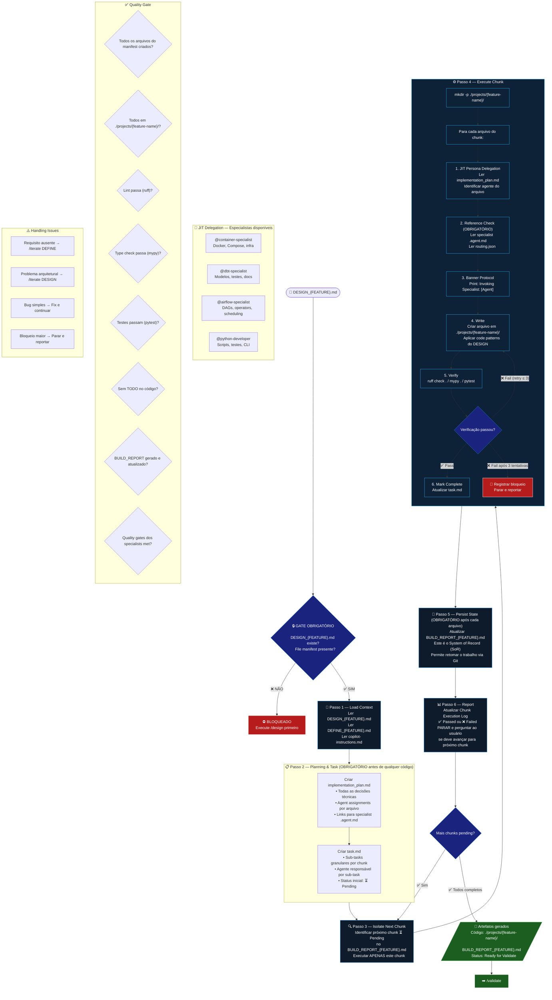

# Fase 3 — BUILD



## Regras Rápidas

| # | Regra |
|---|---|
| 1 | **GATE DURO**: sem `DESIGN_{FEATURE}.md` com manifest → bloqueado |
| 2 | `implementation_plan.md` e `task.md` **obrigatórios antes de qualquer código** |
| 3 | Executar **apenas o próximo chunk pending** — nunca o projeto inteiro de uma vez |
| 4 | Todo arquivo vai para `./projects/{feature-name}/` — nunca na raiz |
| 5 | `BUILD_REPORT` é o **System of Record** — atualizar após cada arquivo |
| 6 | Verificação falha → retry até **3 vezes** antes de registrar bloqueio |
| 7 | Cada arquivo tem um **specialist agent** definido no implementation_plan |
| 8 | PARAR após cada chunk e perguntar ao usuário antes de continuar |

## Execution Loop

```text
BUILD_REPORT (SoR)
      │
      ▼
Próximo chunk ⏳ Pending
      │
      ▼
Para cada arquivo do chunk:
  → JIT delegate → write → verify → persist
      │                         │
      │ ✅                      │ ❌ (retry ≤ 3)
      ▼                         ▼
  task.md updated          fix + retry
      │
      ▼
BUILD_REPORT updated → STOP → aguardar usuário
```
