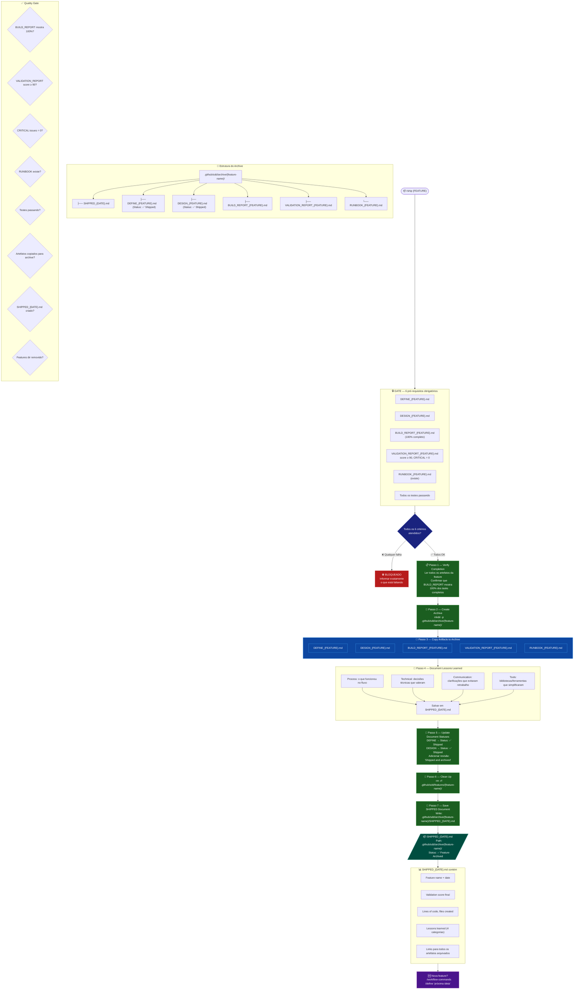

# Fase 4 — SHIP



## Regras Rápidas

| # | Regra |
|---|---|
| 1 | **6 pré-requisitos** — qualquer um faltando → bloqueado |
| 2 | `VALIDATION_REPORT` com **score ≥ 90 E CRITICAL = 0** é obrigatório |
| 3 | `RUNBOOK_{FEATURE}.md` deve existir (gerado pelo /validate) |
| 4 | **Lessons learned** documentadas em 4 categorias |
| 5 | Artefatos são **copiados** para archive, não movidos direto |
| 6 | DEFINE e DESIGN recebem **Status: ✅ Shipped** antes de arquivar |
| 7 | `.github/sdd/features/{feature-name}/` é **removido** após arquivar |
| 8 | Código permanece em `./projects/{feature-name}/` — não é removido |

## Lessons Learned — Guia

| Categoria | Exemplos de entrada |
|---|---|
| **Process** | "Quebrar em chunks menores ajudou" · "Mais checkpoints no brainstorm" |
| **Technical** | "Config via YAML > env vars" · "Specialist X foi crucial para Y" |
| **Communication** | "Clarificar escopo antes do design evitou retrabalho" |
| **Tools** | "Biblioteca X simplificou Z" · "Usar pattern do KB economizou tempo" |

## Archive vs Features

```text
Durante desenvolvimento:
  .github/sdd/features/{feature-name}/   ← artefatos ativos

Após /ship:
  .github/sdd/archive/{feature-name}/    ← artefatos permanentes
  .github/sdd/features/{feature-name}/   ← REMOVIDO
  ./projects/{feature-name}/             ← código permanece
```
