# SDD Workflow Graph — Brainstorm → Define → Design

> Grafo completo com todas as regras, gates, e fluxo mental das fases 0, 1 e 2 do Spec-Driven Development.

```mermaid
flowchart TD
    %% ─── ENTRY POINT ───────────────────────────────────────────────
    START(["`**ENTRADA**
    Ideia / Notas / Conversa`"])

    START --> GROUNDING

    %% ─── GROUNDING OBRIGATÓRIO ─────────────────────────────────────
    subgraph GROUNDING["🔍 GROUNDING OBRIGATÓRIO (todas as fases)"]
        direction TB
        G1[Ler CLAUDE.md]
        G2[Ler WORKFLOW_CONTRACTS.yaml]
        G3[Verificar skill relevante]
        G4[Carregar KB domains pertinentes ≤ 3 arquivos]
        G1 --> G2 --> G3 --> G4
    end

    GROUNDING --> PHASE0

    %% ═══════════════════════════════════════════════════════════════
    %% FASE 0 — BRAINSTORM
    %% ═══════════════════════════════════════════════════════════════
    subgraph PHASE0["⚡ FASE 0 — BRAINSTORM  (confidence: 0.85)"]
        direction TB

        subgraph KB0["KB-FIRST RESOLUTION"]
            direction LR
            KB0A["1. KB Discovery\n(domínio relevante?)"]
            KB0B["2. Codebase Exploration\n(padrões existentes?)"]
            KB0C["3. Confidence Assignment\n(0.0 → 1.0)"]
            KB0D["4. MCP Validation\n(se conf < 0.85)"]
            KB0A --> KB0B --> KB0C --> KB0D
        end

        B_S1["PASSO 1 — Gather Context\nLer BRAINSTORM existente?\nCarregar contexto do projeto"]
        B_S2["PASSO 2 — Discovery Questions\n≥ 3 perguntas obrigatórias\nPreferir múltipla escolha\nEvitar question dump"]
        B_S3["PASSO 3 — Sample Collection\nColetar: inputs, outputs,\nground truth p/ grounding LLM"]
        B_S4["PASSO 4 — Explore Approaches\n2–3 abordagens com trade-offs\nNão apresentar abordagem única"]
        B_S5["PASSO 5 — Apply YAGNI\n'Precisa disso para MVP?'\nChecklist de simplificação"]
        B_S6["PASSO 6 — Validate Incrementally\n≥ 2 checkpoints de validação\nPresentar progresso ao usuário"]
        B_S7["PASSO 7 — Generate Document\nSalvar BRAINSTORM_{FEATURE}.md"]

        KB0 --> B_S1
        B_S1 --> B_S2
        B_S2 --> B_S3
        B_S3 --> B_S4
        B_S4 --> B_S5
        B_S5 --> B_S6
        B_S6 --> B_S7

        subgraph B_ANTI["🚫 Anti-Patterns (FASE 0)"]
            direction LR
            BA1["Question dump\n(muitas perguntas de uma vez)"]
            BA2["Assumir respostas\nsem perguntar"]
            BA3["Apresentar\nAbordagem única"]
            BA4["Ignorar\nconstraints técnicos"]
        end

        subgraph B_GATE["✅ Quality Gate BRAINSTORM"]
            direction TB
            BG1["Problema claro e específico?"]
            BG2["Usuários identificados?"]
            BG3["≥ 2 abordagens com trade-offs?"]
            BG4["YAGNI aplicado?"]
            BG5["Samples coletados (LLM use case)?"]
            BG6["≥ 2 checkpoints validados?"]
            BG7["Status = Ready for Define?"]
        end

        B_S7 --> B_GATE
    end

    %% Status transitions BRAINSTORM
    B_GATE --> B_STATUS{Passou quality gate?}
    B_STATUS -->|"❌ Não"| B_S2
    B_STATUS -->|"✅ Sim"| B_OUTPUT

    B_OUTPUT[/"📄 BRAINSTORM_{FEATURE}.md
    Status: ✅ Complete — Ready for Define
    Path: .github/sdd/features/{feature-name}/"/]

    %% ═══════════════════════════════════════════════════════════════
    %% GATE: DEFINE pode começar sem BRAINSTORM
    %% ═══════════════════════════════════════════════════════════════
    B_OUTPUT --> DEFINE_GATE

    DIRECT_INPUT(["Requisito direto /\nnotas de reunião /\nemail thread"]) --> DEFINE_GATE

    DEFINE_GATE{"Define pode começar\nsem BRAINSTORM?"}
    DEFINE_GATE -->|"✅ Sim\n(BRAINSTORM é opcional em /define)"| PHASE1
    DEFINE_GATE -->|"🔄 Fluxo normal"| PHASE1

    %% ═══════════════════════════════════════════════════════════════
    %% FASE 1 — DEFINE
    %% ═══════════════════════════════════════════════════════════════
    subgraph PHASE1["📋 FASE 1 — DEFINE  (confidence: 0.90)"]
        direction TB

        subgraph KB1["KB-FIRST RESOLUTION"]
            direction LR
            KB1A["1. KB Discovery"]
            KB1B["2. Template Loading\n(.github/sdd/templates/)"]
            KB1C["3. Confidence Assignment"]
            KB1A --> KB1B --> KB1C
        end

        D_S1["PASSO 1 — Load Context\nLer BRAINSTORM (se existir)\nCarregar templates"]

        D_S2["PASSO 2 — Classify Input
        ┌─ brainstorm_document
        ├─ meeting_notes
        ├─ email_thread
        ├─ conversation
        ├─ direct_requirement
        └─ mixed_sources"]

        D_S3["PASSO 3 — Extract Entities
        ┌─ Problem Statement
        ├─ Users (com pain points)
        ├─ Goals (MoSCoW)
        ├─ Success Criteria (testáveis)
        ├─ Acceptance Tests
        ├─ Constraints
        └─ Out of Scope"]

        subgraph CLARITY["📊 PASSO 4 — Clarity Score (0–15)"]
            direction TB
            CS1["Problem:  0–3\n(claro, específico, acionável)"]
            CS2["Users:    0–3\n(identificados + pain points)"]
            CS3["Goals:    0–3\n(mensuráveis + MoSCoW)"]
            CS4["Success:  0–3\n(critérios testáveis)"]
            CS5["Scope:    0–3\n(limites explícitos)"]
            CS_TOTAL["TOTAL: soma dos 5 elementos"]
            CS1 & CS2 & CS3 & CS4 & CS5 --> CS_TOTAL
        end

        CS_TOTAL --> CS_DECISION{Score?}
        CS_DECISION -->|"12–15 🟢 HIGH\n→ Prosseguir"| D_S5
        CS_DECISION -->|"9–11 🟡 MEDIUM\n→ Preencher gaps"| D_S4
        CS_DECISION -->|"0–8 🔴 LOW\n→ Bloquear, coletar mais info"| D_S4

        D_S4["PASSO 5 — Fill Gaps\nPerguntas de fallback\npor elemento com score baixo"]
        D_S4 --> CLARITY

        D_S5["PASSO 6 — Generate Document
        Seções obrigatórias:
        1. Problem Statement
        2. Users & Personas
        3. Goals (MoSCoW)
        4. Success Criteria
        5. Acceptance Tests
        6. Constraints
        7. Out of Scope
        8. Technical Context (localização, KB, IaC)
        9. Data Engineering Context (se aplicável)"]

        subgraph D_DE["🔧 Data Engineering Context (quando aplicável)"]
            direction LR
            DE1["Source Inventory"]
            DE2["Freshness SLAs"]
            DE3["Schema Contracts"]
            DE4["Completeness Metrics"]
            DE5["Volume Estimates"]
        end

        D_S5 --> D_DE

        subgraph D_ANTI["🚫 Anti-Patterns (FASE 1)"]
            direction LR
            DA1["Linguagem vaga\n('melhorar performance')"]
            DA2["Critérios\nnão testáveis"]
            DA3["Usuários\nnão identificados"]
            DA4["Detalhes de\nimplementação no DEFINE"]
        end

        subgraph D_GATE["✅ Quality Gate DEFINE"]
            direction TB
            DG1["Clarity Score ≥ 12/15?"]
            DG2["Todos os usuários identificados?"]
            DG3["Critérios de sucesso testáveis?"]
            DG4["MoSCoW aplicado?"]
            DG5["Escopo explícito (in/out)?"]
            DG6["Acceptance Tests escritos?"]
            DG7["Tech context mapeado?"]
            DG8["Data context (se DE) incluído?"]
            DG9["Status = Ready for Design?"]
        end

        KB1 --> D_S1
        D_S1 --> D_S2 --> D_S3 --> CLARITY
        D_DE --> D_GATE
    end

    DEFINE_GATE --> PHASE1

    D_GATE --> D_STATUS{Passou quality gate?}
    D_STATUS -->|"❌ Não (score < 12)"| D_S4
    D_STATUS -->|"✅ Sim"| D_OUTPUT

    D_OUTPUT[/"📄 DEFINE_{FEATURE}.md
    Status: ✅ Complete — Ready for Design
    Path: .github/sdd/features/{feature-name}/
    Clarity Score: NN/15"/]

    %% ═══════════════════════════════════════════════════════════════
    %% GATE OBRIGATÓRIO: DEFINE → DESIGN
    %% ═══════════════════════════════════════════════════════════════
    D_OUTPUT --> DESIGN_MANDATORY_GATE

    DESIGN_MANDATORY_GATE{"🔒 GATE OBRIGATÓRIO
    DEFINE_{FEATURE}.md existe?"}
    DESIGN_MANDATORY_GATE -->|"❌ NÃO — BLOQUEADO"| BLOCK_DESIGN["⛔ /design BLOQUEADO
    Executar /define primeiro"]
    DESIGN_MANDATORY_GATE -->|"✅ SIM — Prosseguir"| PHASE2

    %% ═══════════════════════════════════════════════════════════════
    %% FASE 2 — DESIGN
    %% ═══════════════════════════════════════════════════════════════
    subgraph PHASE2["🏗️ FASE 2 — DESIGN  (confidence: 0.95)"]
        direction TB

        subgraph KB2["KB-FIRST RESOLUTION"]
            direction LR
            KB2A["1. KB Pattern Loading\n(padrões relevantes)"]
            KB2B["2. Agent Discovery\n(routing.json)"]
            KB2C["3. Confidence Assignment"]
            KB2D["4. MCP Validation\n(se conf < 0.95)"]
            KB2A --> KB2B --> KB2C --> KB2D
        end

        DS_S1["PASSO 1 — Load Context\nLer DEFINE_{FEATURE}.md\nCarregar KB domains\nVerificar routing.json"]

        DS_S2["PASSO 2 — Create Architecture
        ┌─ Diagrama ASCII obrigatório
        ├─ Decisões de componentes
        ├─ Estratégia de integração
        └─ Stack tecnológica justificada"]

        subgraph ADR["📝 PASSO 3 — Inline ADR (por decisão)"]
            direction TB
            ADR1["Status: Proposed | Accepted | Deprecated | Superseded"]
            ADR2["Date: YYYY-MM-DD"]
            ADR3["Context: situação que força a decisão"]
            ADR4["Choice: decisão tomada"]
            ADR5["Rationale: por quê essa escolha"]
            ADR6["Alternatives Rejected: o que foi descartado"]
            ADR7["Consequences: impactos e trade-offs"]
        end

        DS_S3["PASSO 4 — File Manifest
        Tabela: # | file_path | action | purpose | dependencies
        Actions: CREATE | MODIFY | DELETE | READ
        Toda dependência mapeada"]

        subgraph AGENT_MATCH["🤖 PASSO 5 — Agent Matching"]
            direction TB
            AM1["File Type → peso HIGH"]
            AM2["Purpose Keywords → peso HIGH"]
            AM3["Path Patterns → peso MEDIUM"]
            AM4["KB Domain → peso MEDIUM"]
            AM_RESULT["Assign specialist agent\nper file/component"]
            AM1 & AM2 & AM3 & AM4 --> AM_RESULT
        end

        DS_S4["PASSO 6 — Code Patterns
        Snippets copy-paste ready\nFromados em KB patterns\nPor tipo de arquivo/componente"]

        DS_S5["PASSO 7 — Testing Strategy
        ┌─ Unit Tests: lógica isolada
        ├─ Integration Tests: contratos entre componentes
        └─ E2E Tests: fluxo ponta a ponta"]

        subgraph PIPELINE_ARCH["🔄 Pipeline Architecture (quando DE)"]
            direction LR
            PA1["DAG Diagram"]
            PA2["Partition Strategy"]
            PA3["Incremental Strategy"]
            PA4["Schema Evolution"]
        end

        subgraph DESIGN_PRINCIPLES["📐 Princípios de Design"]
            direction LR
            DP1["Self-Contained\n(sem deps externas desnecessárias)"]
            DP2["Config Over Code\n(comportamento via config)"]
            DP3["KB Patterns\n(reutilizar padrões validados)"]
            DP4["Agent Specialization\n(delegar ao agente certo)"]
            DP5["Testable\n(design facilita testes)"]
        end

        subgraph DS_ANTI["🚫 Anti-Patterns (FASE 2)"]
            direction LR
            DSA1["Arquitetura sem\ndiagrama ASCII"]
            DSA2["Decisão sem ADR\n(não documentada)"]
            DSA3["File manifest\nincompleto"]
            DSA4["Over-engineering\n(YAGNI violado)"]
        end

        subgraph DS_GATE["✅ Quality Gate DESIGN"]
            direction TB
            DSG1["Diagrama de arquitetura presente?"]
            DSG2["ADR para cada decisão crítica?"]
            DSG3["File manifest completo?"]
            DSG4["Agent matching definido?"]
            DSG5["Code patterns copy-paste ready?"]
            DSG6["Testing strategy definida (U/I/E2E)?"]
            DSG7["Pipeline arch (se DE) documentada?"]
            DSG8["Princípios de design respeitados?"]
            DSG9["Status = Ready for Build?"]
        end

        KB2 --> DS_S1
        DS_S1 --> DS_S2 --> ADR --> DS_S3
        DS_S3 --> AGENT_MATCH --> DS_S4 --> DS_S5
        DS_S5 --> PIPELINE_ARCH
        PIPELINE_ARCH --> DESIGN_PRINCIPLES
        DESIGN_PRINCIPLES --> DS_GATE
    end

    DESIGN_MANDATORY_GATE -->|"✅ SIM"| PHASE2

    DS_GATE --> DS_STATUS{Passou quality gate?}
    DS_STATUS -->|"❌ Não"| DS_S2
    DS_STATUS -->|"✅ Sim"| DS_OUTPUT

    DS_OUTPUT[/"📄 DESIGN_{FEATURE}.md
    Status: ✅ Complete — Ready for Build
    Path: .github/sdd/features/{feature-name}/
    Contém: Arquitetura + ADRs + Manifest + Patterns + Tests"/]

    DS_OUTPUT --> NEXT_PHASES

    NEXT_PHASES{"/build (Fase 3)\nou /iterate (Cross-Phase)"}

    %% ═══════════════════════════════════════════════════════════════
    %% ITERATE — CROSS-PHASE
    %% ═══════════════════════════════════════════════════════════════
    subgraph ITERATE["🔄 /iterate — Cross-Phase Update"]
        direction TB
        IT1["Detectar change type:
        Additive (low impact)
        Modifying (medium)
        Removing (medium)
        Architectural (high)"]

        IT2["Regra de escala:
        < 30% mudança → /iterate
        > 50% mudança → novo /define"]

        IT3["Cascade Rules:
        BRAINSTORM mudou →
          revisar DEFINE (approach, users, constraints)
        DEFINE mudou →
          revisar DESIGN (components, decisions, manifest)
        DESIGN mudou →
          code precisa refatorar"]

        IT1 --> IT2 --> IT3
    end

    B_OUTPUT -.->|"mudança pós-brainstorm"| ITERATE
    D_OUTPUT -.->|"mudança pós-define"| ITERATE
    DS_OUTPUT -.->|"mudança pós-design"| ITERATE
    ITERATE -.->|"atualiza fase anterior"| PHASE0
    ITERATE -.->|"atualiza fase anterior"| PHASE1
    ITERATE -.->|"atualiza fase anterior"| PHASE2

    %% ═══════════════════════════════════════════════════════════════
    %% NAMING CONVENTIONS
    %% ═══════════════════════════════════════════════════════════════
    subgraph NAMING["📁 Naming Conventions"]
        direction LR
        N1["Feature: SCREAMING_SNAKE_CASE\nex: USER_NOTIFICATIONS"]
        N2["Directory: kebab-case\nex: user-notifications"]
        N3["Files:\nBRAINSTORM_{FEATURE}.md\nDEFINE_{FEATURE}.md\nDESIGN_{FEATURE}.md"]
    end

    %% ─── STYLING ────────────────────────────────────────────────────
    classDef phase0 fill:#1a1a2e,stroke:#e94560,color:#fff,stroke-width:2px
    classDef phase1 fill:#16213e,stroke:#0f3460,color:#fff,stroke-width:2px
    classDef phase2 fill:#0f3460,stroke:#533483,color:#fff,stroke-width:2px
    classDef gate fill:#e94560,stroke:#fff,color:#fff,stroke-width:2px
    classDef output fill:#533483,stroke:#e94560,color:#fff,stroke-width:2px
    classDef block fill:#c0392b,stroke:#fff,color:#fff,stroke-width:2px
    classDef grounding fill:#27ae60,stroke:#fff,color:#fff,stroke-width:2px
    classDef iterate fill:#e67e22,stroke:#fff,color:#fff,stroke-width:2px

    class PHASE0 phase0
    class PHASE1 phase1
    class PHASE2 phase2
    class DESIGN_MANDATORY_GATE,B_STATUS,D_STATUS,DS_STATUS gate
    class B_OUTPUT,D_OUTPUT,DS_OUTPUT output
    class BLOCK_DESIGN block
    class GROUNDING grounding
    class ITERATE iterate
```



---

## Resumo das Regras Críticas

| Regra | Detalhe |
|---|---|
| **GROUNDING obrigatório** | CLAUDE.md + WORKFLOW_CONTRACTS.yaml antes de qualquer fase |
| **/define sem /brainstorm** | Permitido — brainstorm é opcional |
| **/design sem /define** | **BLOQUEADO** — DEFINE_{FEATURE}.md é obrigatório |
| **Clarity Score mínimo** | 12/15 para sair do /define |
| **Confidence thresholds** | Brainstorm 0.85 · Define 0.90 · Design 0.95 |
| **YAGNI** | Aplicado em brainstorm e respeitado em design |
| **ADR obrigatório** | Toda decisão arquitetural precisa de inline ADR (7 elementos) |
| **File manifest** | Tabela completa: path · action · purpose · dependencies |
| **Agent matching** | Arquivo → agente especialista via routing.json |
| **/iterate threshold** | < 30% → iterate · > 50% → novo /define |
| **Cascade** | Mudança em fase anterior propaga para fases seguintes |

## Paths de Artefatos

```
.github/sdd/features/{feature-name}/
├── BRAINSTORM_{FEATURE}.md     ← Fase 0
├── DEFINE_{FEATURE}.md         ← Fase 1
├── DESIGN_{FEATURE}.md         ← Fase 2
├── BUILD_REPORT_{FEATURE}.md   ← Fase 3
├── VALIDATION_REPORT_{FEATURE}.md ← Fase 3.5
└── RUNBOOK_{FEATURE}.md        ← Fase 3.5 (se aprovado)
```
