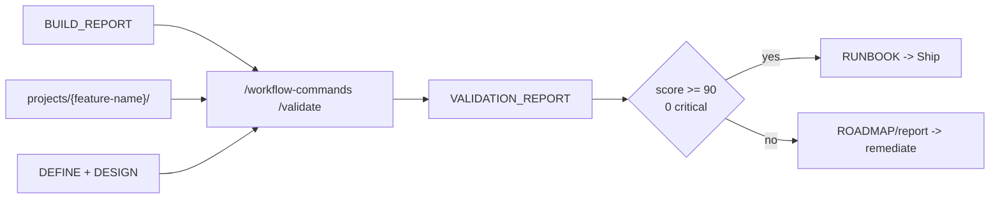

# Core Concepts

AgentSpec is a local operating model for GitHub Copilot. It defines how Copilot chooses context, which agent owns the task, which knowledge should be loaded, and which workflow phase is allowed to run.

## Grounding

Grounding is the first step of every operational response.

```text
.github/config/grounding.md
```

It defines:

- the required operational grounding response block
- skill priority over routing
- maximum KB loading rules
- workflow initialization rules
- fallback to the default agent

## Skills

Skills are command groups under `.github/skills/`. A skill invocation always wins over generic intent routing.

| Skill | Purpose |
|---|---|
| `workflow-commands` | SDD lifecycle: brainstorm, define, design, build, ship, iterate, create-pr |
| `validate` | Phase 3.5 validation runtime used by workflow before Ship |
| `data-engineering-commands` | Pipeline, schema, quality, lakehouse, SQL review, AI pipeline, contracts, migration |
| `knowledge-commands` | Create, update, and refresh local KB domains |
| `core-commands` | Status, meeting analysis, memory, README generation, context sync |
| `review-commands` | Review and judge flows |
| `visual-explainer` | HTML visual explanations, diagrams, slides, fact checks, recaps |
| `excalidraw-diagram` | Excalidraw diagram generation |

Invocation:

```text
/<skill-folder> /<command> <args>
```

## Routing

When no skill is invoked, Copilot reads:

```text
.github/config/routing.json
```

The router maps trigger words to:

- route id
- agent path
- minimal KB files
- optional full KB domain
- category

If no route matches, Copilot uses `the-planner`.

## Agents

Agents are specialist instruction files under `.github/agents/`.

They define:

- identity and domain
- model preference
- tools
- KB resolution strategy
- capabilities
- quality gates
- escalation rules
- stop conditions

Agents are not generic personas. They are operational contracts for a domain.

## Knowledge Bases

KB domains live under `.github/kb/{domain}/`.

Common structure:

```text
.github/kb/{domain}/
├── index.md
├── quick-reference.md
├── concepts/
├── patterns/
└── specs/
```

The grounding policy is lazy:

1. Load quick reference first.
2. Load concepts or patterns only when needed.
3. Load at most three KB files by default.
4. Use external validation only when a skill or agent requires it.

## SDD Workflow

SDD is the structured feature lifecycle:

```text
Brainstorm -> Define -> Design -> Build -> Validate -> Ship
```

| Phase | Agent | Responsibility |
|---|---|---|
| Brainstorm | `brainstorm-agent` | Explore intent, options, risks, and unknowns |
| Define | `define-agent` | Convert ideas into requirements and acceptance criteria |
| Design | `design-agent` | Create architecture, decisions, patterns, and manifest |
| Build | `build-agent` | Execute the manifest with delegation and evidence |
| Validate | `validate-agent` | Score implementation against requirements, design, code quality, and production readiness |
| Ship | `ship-agent` | Verify completion, archive, and record lessons |
| Iterate | `iterate-agent` | Update SDD artifacts across phase boundaries |

Workflow phases must be started through `/workflow-commands`. Validate is mandatory after Build; Ship should require an approved `VALIDATION_REPORT_{FEATURE}.md` and `RUNBOOK_{FEATURE}.md`.

## Validate Gate

Validate reads DEFINE, DESIGN, BUILD_REPORT, and the implementation tree under `projects/{feature-name}/`. It always writes a validation report. A score of at least 90 with zero CRITICAL findings generates a runbook and allows Ship. A lower score generates remediation guidance and sends the feature back through Build and Validate.



## Delegation

Build can delegate scoped tasks to specialist agents through Copilot's built-in `agent` tool and `runSubagent`.

The delegation packet should include:

- target artifact
- purpose
- relevant DESIGN context
- assigned agent
- required KB references
- quality gate checklist
- expected evidence

The Build report should record what was delegated, what evidence was returned, and whether the quality gate passed.

## Review And Judge

Review flows are split:

- `/review-commands /review` uses local review patterns and agent expertise.
- `/review-commands /judge` provides an optional second opinion for high-risk artifacts when an external runtime is configured.

Judge is advisory. Copilot remains responsible for final reasoning and fixes.

## Visual Explanation

Visual skills turn complex plans or systems into HTML pages, slides, diagrams, or Excalidraw JSON. Use them when the information is easier to understand visually than as a dense text table.
