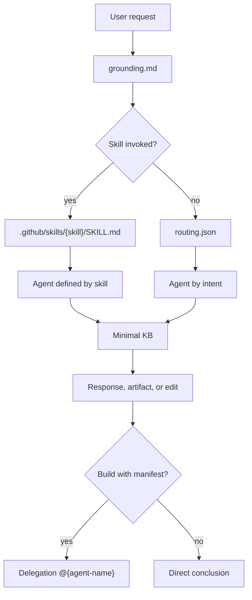
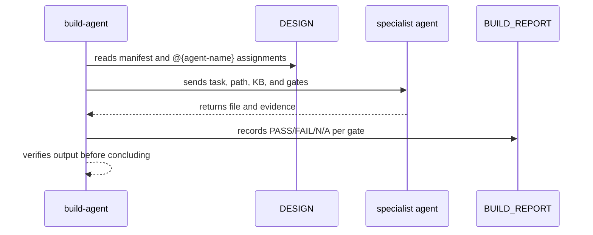

# Agents

Agents in `.github/agents/` are specialized roles that transform a routed intent into an operational stance. They are not just persona names; each file declares a domain, expected tools, thresholds, gates, and quality rules. The router selects the initial agent, and the workflow can delegate parts of an implementation to more specific agents.

Having separate agents matters because the same request may require different reasoning styles. A `schema-designer` thinks in terms of modeling, evolution, and SCD; a `sql-optimizer` thinks in terms of query plans and dialects; a `container-specialist` thinks in terms of images, Compose, tags, and validation. Separating roles reduces bloated prompts and makes each contract auditable in its own file.

## Operational map

## Categories

| Category | Count | Primary use |
|---|---:|---|
| `architect` | 8 | Planning, architecture, schemas, KB, medallion, lakehouse, and GenAI |
| `cloud` | 11 | AWS, GCP, containers, CI/CD, Lambda, Supabase, and deployments |
| `data-engineering` | 15 | dbt, Airflow, Spark, Lakeflow, SQL, streaming, Qdrant, and data pipelines |
| `dev` | 6 | Router, exploration, judge, meetings, prompts, and shell |
| `platform` | 6 | Microsoft Fabric: architecture, security, pipelines, logging, AI, and CI/CD |
| `python` | 6 | Python development, documentation, review, prompts, and LLM |
| `test` | 3 | Testing, data quality, and contracts |
| `workflow` | 7 | Brainstorm, Define, Design, Build, Validate, Ship, and Iterate |

## Summarized catalog

| Category | Agents |
|---|---|
| `architect` | `data-platform-engineer`, `genai-architect`, `kb-architect`, `lakehouse-architect`, `medallion-architect`, `pipeline-architect`, `schema-designer`, `the-planner` |
| `cloud` | `ai-data-engineer-cloud`, `ai-data-engineer-gcp`, `ai-prompt-specialist-gcp`, `aws-data-architect`, `aws-deployer`, `aws-lambda-architect`, `ci-cd-specialist`, `container-specialist`, `gcp-data-architect`, `lambda-builder`, `supabase-specialist` |
| `data-engineering` | `ai-data-engineer`, `airflow-specialist`, `dbt-specialist`, `lakeflow-architect`, `lakeflow-expert`, `lakeflow-pipeline-builder`, `lakeflow-specialist`, `qdrant-specialist`, `spark-engineer`, `spark-performance-analyzer`, `spark-specialist`, `spark-streaming-architect`, `spark-troubleshooter`, `sql-optimizer`, `streaming-engineer` |
| `dev` | `agent-router`, `codebase-explorer`, `judge-agent`, `meeting-analyst`, `prompt-crafter`, `shell-script-specialist` |
| `platform` | `fabric-ai-specialist`, `fabric-architect`, `fabric-cicd-specialist`, `fabric-logging-specialist`, `fabric-pipeline-developer`, `fabric-security-specialist` |
| `python` | `ai-prompt-specialist`, `code-cleaner`, `code-documenter`, `code-reviewer`, `llm-specialist`, `python-developer` |
| `test` | `data-contracts-engineer`, `data-quality-analyst`, `test-generator` |
| `workflow` | `brainstorm-agent`, `define-agent`, `design-agent`, `build-agent`, `validate-agent`, `ship-agent`, `iterate-agent` |

## How an agent should be used

An agent must be read before executing an operational response routed to it. Reading matters because the agent file may contain gates that do not appear in the name. For example, the build-agent requires a manifest, paths under `projects/{feature-name}/`, evidence per specialist, and a build report; the ship-agent requires complete artifacts and validation before archiving.

The initial agent should not load the entire repository. The pattern is to load grounding, router or skill, selected agent, minimal KB, and meta-context when it exists. This model reduces cognitive cost and prevents a simple response from becoming an indiscriminate read of all domains.

## Delegation

Delegation is not blind outsourcing. The build-agent remains responsible for resolving paths, checking gates, and recording evidence. The specialist is responsible for domain knowledge and producing the file within the assigned scope.
