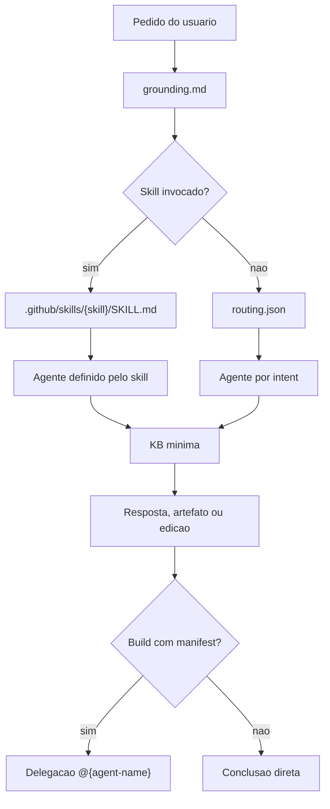
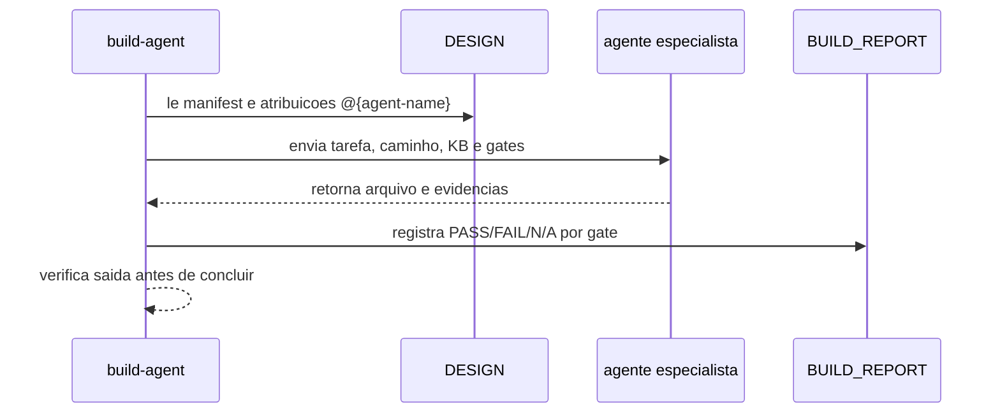

# Agents

Os agentes em `.github/agents/` sao papeis especializados que transformam uma intencao roteada em uma postura operacional. Eles nao sao apenas nomes de personas; cada arquivo declara dominio, ferramentas esperadas, thresholds, gates e regras de qualidade. O router escolhe o agente inicial, e o workflow pode delegar partes de uma implementacao para agentes mais especificos.

Ter agentes separados e importante porque o mesmo pedido pode exigir raciocinios diferentes. Um `schema-designer` pensa em modelagem, evolucao e SCD; um `sql-optimizer` pensa em plano de consulta e dialeto; um `container-specialist` pensa em imagens, Compose, tags e validacao. Separar papeis reduz prompts gigantes e torna cada contrato auditavel em arquivo proprio.

## Mapa operacional

## Categorias

| Categoria | Quantidade | Uso principal |
|---|---:|---|
| `architect` | 8 | Planejamento, arquitetura, schemas, KB, medallion, lakehouse e GenAI |
| `cloud` | 11 | AWS, GCP, containers, CI/CD, Lambda, Supabase e deploy |
| `data-engineering` | 15 | dbt, Airflow, Spark, Lakeflow, SQL, streaming, Qdrant e pipelines de dados |
| `dev` | 6 | Router, exploracao, judge, reunioes, prompts e shell |
| `platform` | 6 | Microsoft Fabric: arquitetura, seguranca, pipelines, logging, AI e CI/CD |
| `python` | 6 | Desenvolvimento Python, documentacao, revisao, prompts e LLM |
| `test` | 3 | Testes, qualidade de dados e contratos |
| `workflow` | 7 | Brainstorm, Define, Design, Build, Validate, Ship e Iterate |

## Catalogo resumido

| Categoria | Agentes |
|---|---|
| `architect` | `data-platform-engineer`, `genai-architect`, `kb-architect`, `lakehouse-architect`, `medallion-architect`, `pipeline-architect`, `schema-designer`, `the-planner` |
| `cloud` | `ai-data-engineer-cloud`, `ai-data-engineer-gcp`, `ai-prompt-specialist-gcp`, `aws-data-architect`, `aws-deployer`, `aws-lambda-architect`, `ci-cd-specialist`, `container-specialist`, `gcp-data-architect`, `lambda-builder`, `supabase-specialist` |
| `data-engineering` | `ai-data-engineer`, `airflow-specialist`, `dbt-specialist`, `lakeflow-architect`, `lakeflow-expert`, `lakeflow-pipeline-builder`, `lakeflow-specialist`, `qdrant-specialist`, `spark-engineer`, `spark-performance-analyzer`, `spark-specialist`, `spark-streaming-architect`, `spark-troubleshooter`, `sql-optimizer`, `streaming-engineer` |
| `dev` | `agent-router`, `codebase-explorer`, `judge-agent`, `meeting-analyst`, `prompt-crafter`, `shell-script-specialist` |
| `platform` | `fabric-ai-specialist`, `fabric-architect`, `fabric-cicd-specialist`, `fabric-logging-specialist`, `fabric-pipeline-developer`, `fabric-security-specialist` |
| `python` | `ai-prompt-specialist`, `code-cleaner`, `code-documenter`, `code-reviewer`, `llm-specialist`, `python-developer` |
| `test` | `data-contracts-engineer`, `data-quality-analyst`, `test-generator` |
| `workflow` | `brainstorm-agent`, `define-agent`, `design-agent`, `build-agent`, `validate-agent`, `ship-agent`, `iterate-agent` |

## Como um agente deve ser usado

Um agente deve ser lido antes de executar uma resposta operacional roteada para ele. A leitura importa porque o arquivo do agente pode conter gates que nao aparecem no nome. Por exemplo, o build-agent exige manifesto, caminhos sob `projects/{feature-name}/`, evidencias por especialista e build report; o ship-agent exige artefatos completos e validacao antes de arquivar.

O agente inicial nao deve carregar todo o repositorio. O padrao e carregar grounding, router ou skill, agente selecionado, KB minima e meta-contexto quando existir. Esse modelo reduz custo cognitivo e evita que uma resposta simples vire uma leitura indiscriminada de todos os dominios.

## Delegacao

Delegacao nao e terceirizacao cega. O build-agent continua responsavel por resolver caminhos, conferir gates e registrar evidencia. O especialista e responsavel pelo conhecimento de dominio e pela producao do arquivo dentro do escopo atribuido.
