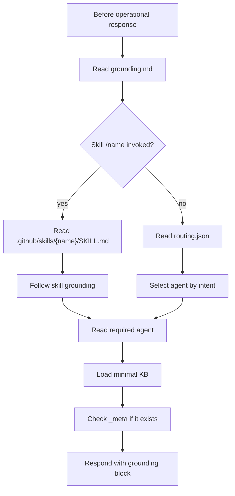
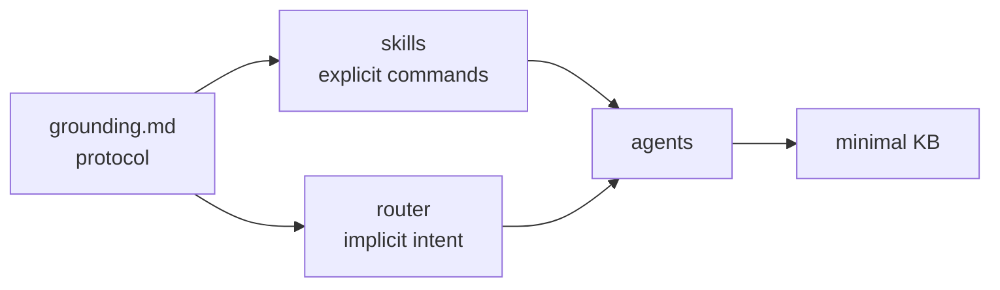

# Grounding

The grounding file at `.github/config/grounding.md` is the initial contract for every operational response in this workspace. It defines the reading order, skill priority, router usage, minimal KB loading, and the block that must open operational responses. Its purpose is to prevent the assistant from responding from memory when it should be anchored to the repository's files.

Having a single grounding file matters because every other part depends on it. Skills, router, agents, KBs, and workflow can evolve, but all of them must agree on the basic execution sequence. If each skill defined its own initial rule, the runtime would become inconsistent and difficult to debug.

## Mandatory order

## Grounding block

The opening block declares the activated specialist, agent path, skill, KB, loaded files, detected project, tier, and budget usage. It functions as an execution receipt: whoever reads the response can tell where the decision came from and which local sources were used.

## Why it exists

Grounding solves four recurring problems in repositories with agents:

| Problem | How grounding helps |
|---|---|
| Out-of-context response | Forces reading of local files before operating |
| Ignored skill | Defines absolute priority for invocation via `/skill-folder` |
| Over-loaded KB | Requires quick-reference and a file limit |
| Incorrectly started workflow | Blocks SDD phases without `/workflow-commands /<phase>` |

## Relationship with skills and router

Grounding does not choose all the details; it ensures the choice happens in the right place. If there is a skill, the skill takes precedence. If there is no skill, the router decides. If there is a conflict, canonical files such as `COPILOT.md` or the skill's own instructions should prevail as indicated.
