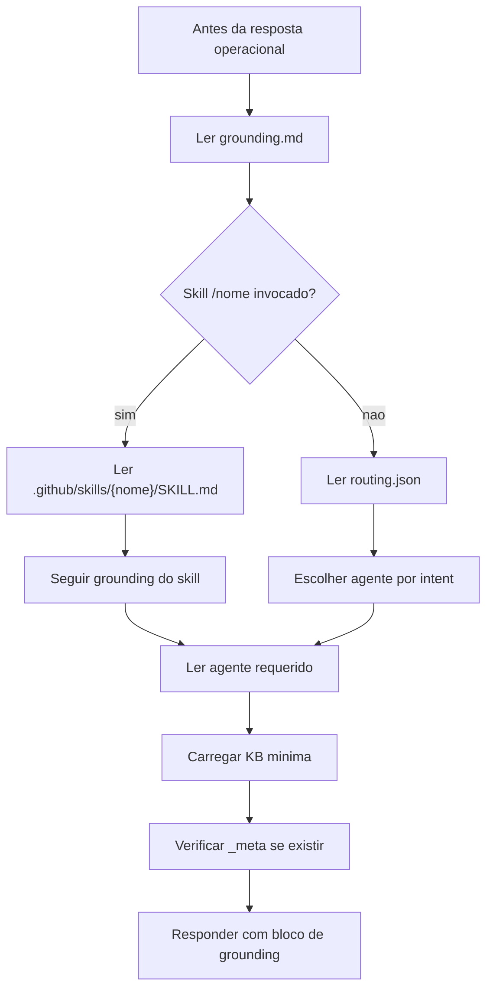
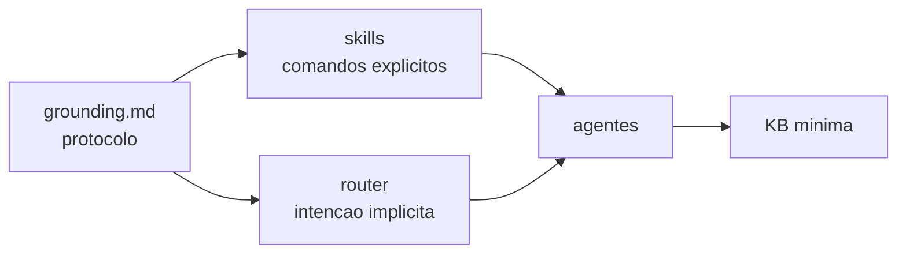

# Grounding

O grounding em `.github/config/grounding.md` e o contrato inicial de toda resposta operacional neste workspace. Ele define a ordem de leitura, a prioridade de skills, o uso do router, o carregamento minimo de KB e o bloco que deve abrir respostas operacionais. Seu papel e impedir que o assistente responda de memoria quando deveria estar ancorado nos arquivos do repositorio.

Ter um arquivo unico de grounding e importante porque todas as outras partes dependem dele. Skills, router, agentes, KBs e workflow podem evoluir, mas todos precisam concordar sobre a sequencia basica de execucao. Se cada skill definisse sua propria regra inicial, o runtime ficaria inconsistente e dificil de debugar.

## Ordem obrigatoria

## Bloco de grounding

O bloco inicial declara o especialista ativado, caminho do agente, skill, KB, arquivos carregados, projeto detectado, tier e uso de budget. Ele funciona como recibo de execucao: quem le a resposta consegue saber de onde a decisao veio e quais fontes locais foram usadas.

## Por que ele existe

Grounding resolve quatro problemas recorrentes em repositorios com agentes:

| Problema | Como grounding ajuda |
|---|---|
| Resposta fora de contexto | Obriga leitura de arquivos locais antes de operar |
| Skill ignorado | Define prioridade absoluta para invocacao por `/skill-folder` |
| KB carregada demais | Exige quick-reference e limite de arquivos |
| Workflow iniciado errado | Bloqueia fases SDD sem `/workflow-commands /<fase>` |

## Relacao com skills e router

O grounding nao escolhe todos os detalhes; ele garante que a escolha aconteca no lugar certo. Se houver skill, o skill manda. Se nao houver skill, o router decide. Se houver conflito, arquivos canonicos como `COPILOT.md` ou instrucoes do proprio skill devem prevalecer conforme indicado.

