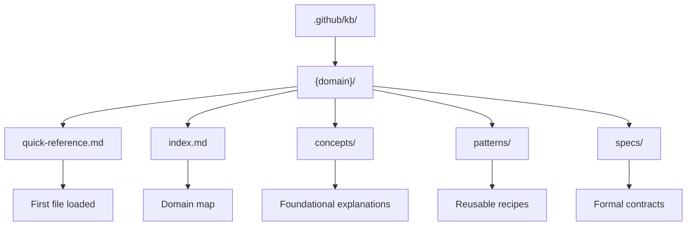
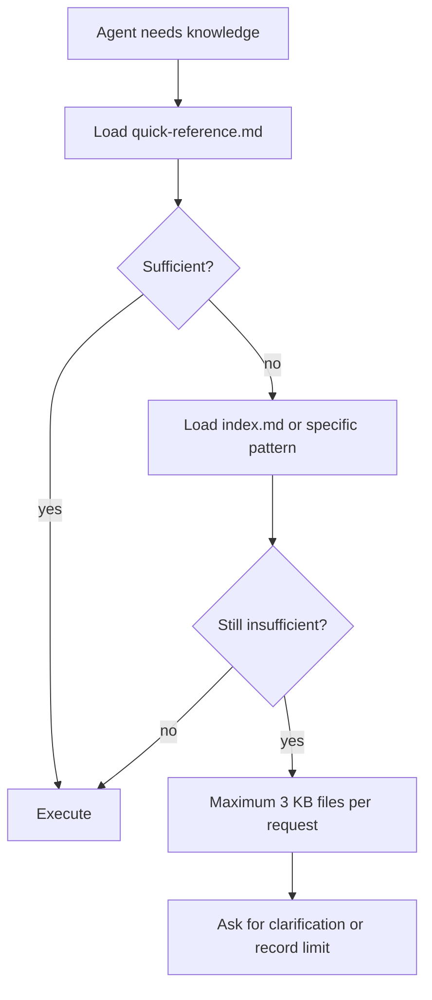

# Knowledge Base

The KBs in `.github/kb/` are the versioned technical memory of AgentSpec. They store quick references, concepts, patterns, and specifications that agents consult before making technical decisions. The goal is not to turn the KB into a massive encyclopedia, but into a local library of patterns that genuinely guide implementation and review.

Keeping KB separate from agents matters because domain knowledge changes at a different pace than the operational role. The `dbt-specialist` can remain the dbt agent while the dbt KB evolves with new incremental patterns, tests, macros, and project organization. This avoids duplicating the same knowledge across multiple agents.

## Structure

## Current domains

| Domain | Common use |
|---|---|
| `ai-data-engineering` | RAG, embeddings, feature stores, and LLMOps |
| `airflow` | DAGs, operators, assets, and orchestration |
| `aws` | AWS architecture and data services |
| `cloud-platforms` | Multi-cloud patterns |
| `containers` | Docker, Compose, images, Kubernetes, and Helm |
| `data-modeling` | Dimensional, Data Vault, SCD, and evolution |
| `data-quality` | Tests, SLAs, observability, and contracts |
| `dbt` | Models, macros, tests, and dbt project |
| `gcp` | BigQuery, Cloud Run, Pub/Sub, GCS, and Vertex AI |
| `genai` | RAG, agents, embeddings, and tool calling |
| `lakeflow` | Databricks Lakeflow and DLT |
| `lakehouse` | Delta, Iceberg, catalogs, and governance |
| `medallion` | Bronze, Silver, Gold, and progressive quality |
| `microsoft-fabric` | Fabric Lakehouse, Data Factory, KQL, and Power BI |
| `modern-stack` | Modern data stack and integrations |
| `prompt-engineering` | Prompts, structured extraction, and evaluation |
| `pydantic` | Modeling, validation, and Python schemas |
| `python` | Python patterns for data engineering |
| `spark` | Spark, PySpark, performance, and troubleshooting |
| `sql-patterns` | Portable SQL, CTEs, windows, and optimization |
| `streaming` | Kafka, Flink, CDC, and continuous processing |
| `supabase` | Postgres, RLS, pgvector, Auth, and Realtime |
| `terraform` | IaC, modules, environments, and validation |
| `testing` | Pytest, fixtures, integration, and strategy |

## Loading policy

The quick-reference should be small, actionable, and up to date. It should contain heuristics, commands, gates, and common pitfalls. Deep files should only be used when a decision or implementation genuinely requires that level of detail.

## Lifecycle

KBs are created when a pattern becomes recurring, updated when a domain evolves, and should be reviewed when they become stale. The `/knowledge-commands` skill provides the operational path to create, update, and refresh these domains.
