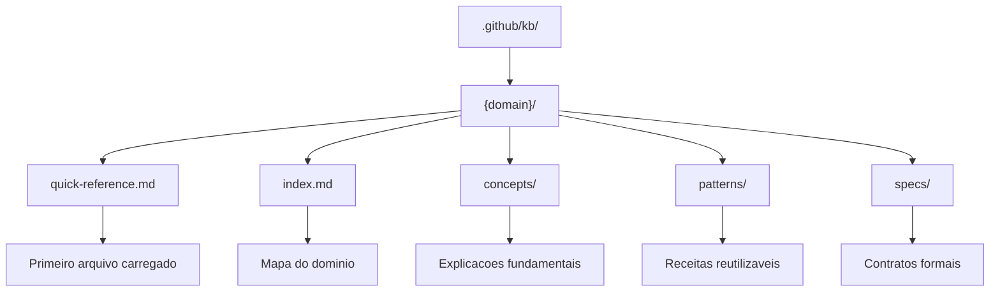
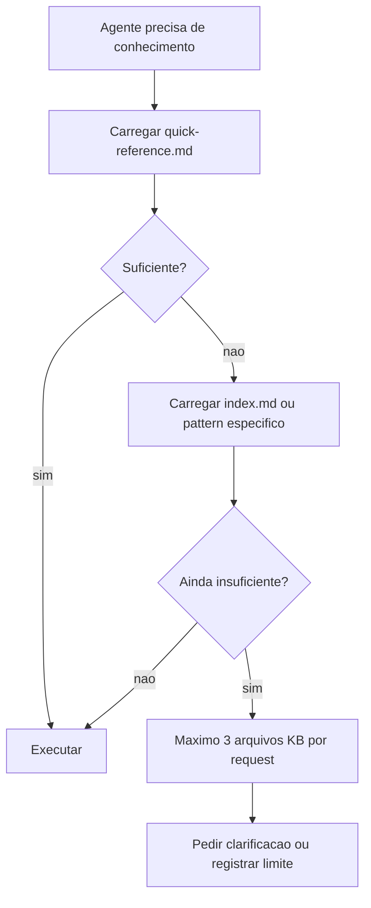

# Knowledge Base

As KBs em `.github/kb/` sao a memoria tecnica versionada do AgentSpec. Elas armazenam referencias rapidas, conceitos, padroes e especificacoes que os agentes consultam antes de tomar decisoes tecnicas. A ideia nao e transformar a KB em uma enciclopedia enorme, mas em uma biblioteca local de padroes que realmente guiam implementacao e revisao.

Ter KB separada de agentes e importante porque conhecimento de dominio muda em ritmo diferente do papel operacional. O `dbt-specialist` pode continuar sendo o agente de dbt, enquanto a KB de dbt evolui com novos padroes de incremental, testes, macros e organizacao de projeto. Isso evita duplicar o mesmo conhecimento em varios agentes.

## Estrutura

## Dominios atuais

| Dominio | Uso comum |
|---|---|
| `ai-data-engineering` | RAG, embeddings, feature stores e LLMOps |
| `airflow` | DAGs, operadores, assets e orquestracao |
| `aws` | Arquitetura e servicos AWS para dados |
| `cloud-platforms` | Padroes multi-cloud |
| `containers` | Docker, Compose, imagens, Kubernetes e Helm |
| `data-modeling` | Dimensional, Data Vault, SCD e evolucao |
| `data-quality` | Testes, SLAs, observabilidade e contratos |
| `dbt` | Modelos, macros, testes e projeto dbt |
| `gcp` | BigQuery, Cloud Run, Pub/Sub, GCS e Vertex AI |
| `genai` | RAG, agentes, embeddings e tool calling |
| `lakeflow` | Databricks Lakeflow e DLT |
| `lakehouse` | Delta, Iceberg, catalogos e governanca |
| `medallion` | Bronze, Silver, Gold e qualidade progressiva |
| `microsoft-fabric` | Fabric Lakehouse, Data Factory, KQL e Power BI |
| `modern-stack` | Stack moderna de dados e integracoes |
| `prompt-engineering` | Prompts, extracao estruturada e avaliacao |
| `pydantic` | Modelagem, validacao e schemas Python |
| `python` | Padroes Python para engenharia de dados |
| `spark` | Spark, PySpark, performance e troubleshooting |
| `sql-patterns` | SQL portavel, CTEs, janelas e otimizacao |
| `streaming` | Kafka, Flink, CDC e processamento continuo |
| `supabase` | Postgres, RLS, pgvector, Auth e Realtime |
| `terraform` | IaC, modulos, ambientes e validacao |
| `testing` | Pytest, fixtures, integracao e estrategia |

## Politica de carregamento

O quick-reference deve ser pequeno, acionavel e atualizado. Ele deve conter heuristicas, comandos, gates e armadilhas comuns. Arquivos profundos devem ser usados apenas quando uma decisao ou implementacao realmente precisa de detalhe.

## Ciclo de vida

KBs nascem quando um padrao se torna recorrente, mudam quando um dominio evolui e devem ser revisadas quando ficarem antigas. O skill `/knowledge-commands` fornece o caminho operacional para criar, atualizar e refrescar esses dominios.
