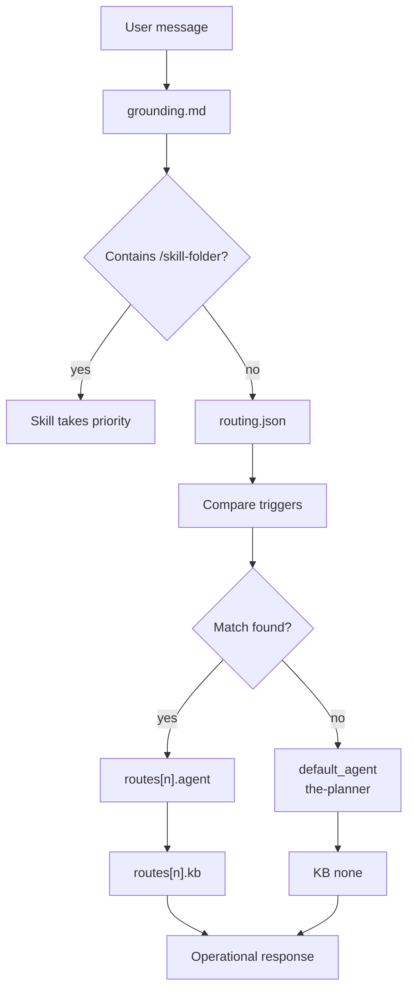

# Router

The router at `.github/config/routing.json` is the intent map of AgentSpec. When the user does not invoke a skill with `/<skill-folder>`, the runtime looks for triggers in the request, selects a route, and activates the declared agent. Each route can point to minimal KBs, a category, and a full KB for on-demand lookup.

Having a separate router is necessary because the workspace has many specialists. Without explicit routing, the assistant would need to infer the correct role from memory on every turn. The `routing.json` file makes that decision versioned, reviewable, and testable. When a new domain enters AgentSpec, the route can be added without rewriting all the agents.

## Route decision



## File components

| Field | Function |
|---|---|
| `version` | Versions the router contract |
| `default_agent` | Agent used when no route matches |
| `token_budget` | Defines lazy loading, KB limit, and quick-reference preference |
| `routes[].id` | Logical route name |
| `routes[].triggers` | Words or expressions that activate the route |
| `routes[].agent` | Selected agent file |
| `routes[].kb` | Minimal KB loaded for the route |
| `routes[].kb_full` | Full domain for lookup when quick-reference is not enough |
| `routes[].category` | Operational category of the agent |

## Why not put this in grounding

Grounding defines the universal protocol; router defines specific intent choices. Mixing the two would make grounding large, unstable, and harder to audit. Kept separate, grounding stays small and normative while the router can evolve with new agents and triggers.

## Maintenance rules

When creating a new route, use triggers specific enough to avoid accidental captures. The route must point to an existing agent and, when technical, to a minimal KB. If the domain does not yet have a KB, that should be explicit; do not use a similar KB just to fill the table.

Validate the file with:

```bash
python3 -m json.tool .github/config/routing.json
```
