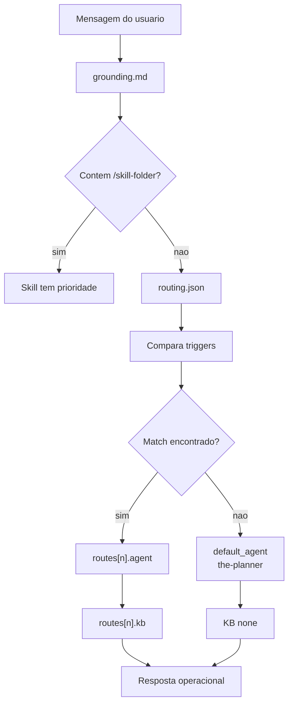

# Router

O router em `.github/config/routing.json` e o mapa de intencoes do AgentSpec. Quando o usuario nao invoca uma skill com `/<skill-folder>`, o runtime procura gatilhos no pedido, escolhe uma rota e ativa o agente declarado. Cada rota pode apontar para KBs minimas, categoria e KB completa para consulta sob demanda.

Ter um router separado e necessario porque o workspace tem muitos especialistas. Sem roteamento explicito, o assistente precisaria inferir o papel correto de memoria em cada turno. O arquivo `routing.json` torna essa decisao versionada, revisavel e testavel. Quando um novo dominio entra no AgentSpec, a rota pode ser adicionada sem reescrever todos os agentes.

## Decisao de rota



## Componentes do arquivo

| Campo | Funcao |
|---|---|
| `version` | Versiona o contrato do router |
| `default_agent` | Agente usado quando nenhuma rota combina |
| `token_budget` | Define carregamento lazy, limite de KB e preferencia por quick-reference |
| `routes[].id` | Nome logico da rota |
| `routes[].triggers` | Palavras ou expressoes que ativam a rota |
| `routes[].agent` | Arquivo do agente selecionado |
| `routes[].kb` | KB minima carregada para a rota |
| `routes[].kb_full` | Dominio completo para consulta quando o quick-reference nao basta |
| `routes[].category` | Categoria operacional do agente |

## Por que nao colocar isso no grounding

Grounding define o protocolo universal; router define escolhas especificas de intencao. Misturar os dois tornaria o grounding grande, instavel e mais dificil de auditar. Separados, o grounding permanece pequeno e normativo, enquanto o router pode evoluir com novos agentes e gatilhos.

## Regras de manutencao

Ao criar uma nova rota, use triggers especificos o bastante para evitar capturas acidentais. A rota deve apontar para um agente existente e, quando tecnica, para uma KB minima. Se o dominio ainda nao tem KB, isso deve ser explicito; nao use uma KB parecida apenas para preencher tabela.

Valide o arquivo com:

```bash
python3 -m json.tool .github/config/routing.json
```
