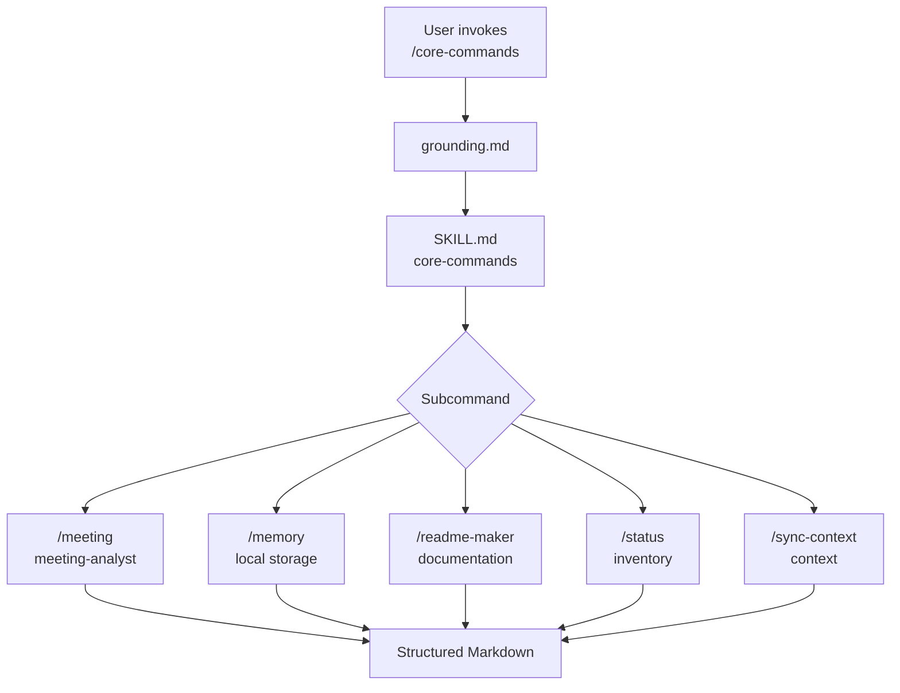

# Core Commands Skill

The `/core-commands` skill groups operational support commands for daily use of AgentSpec. It does not start SDD phases and does not replace the router; its function is to handle cross-cutting activities such as reading status, session memory, meeting analysis, context synchronization, and README generation. For this reason it is treated as a utility layer: it helps the operator maintain context, transform scattered information into readable artifacts, and query workspace state without entering the formal Brainstorm, Define, Design, Build, or Ship flow.

The reason a separate skill exists for core commands is to reduce ambiguity. Without this grouping, requests like "save this", "analyze this meeting", or "what's the status" could fall into planning, review, or development agents. By requiring `/core-commands`, the runtime makes it clear that the intent is administrative and that the expected result is documentation, memory, or a status report — not an implementation.

## Commands

| Command | Role | Expected output |
|---|---|---|
| `/core-commands /meeting` | Extracts decisions, actions, open questions, and insights from minutes or transcripts | Structured Markdown analysis |
| `/core-commands /memory` | Saves relevant session learnings to `.github/storage/` | Memory file per date |
| `/core-commands /readme-maker` | Generates or improves README with a focus on operational clarity | README or README snippet |
| `/core-commands /status` | Summarizes the state of AgentSpec and its artifacts | Workspace status |
| `/core-commands /sync-context` | Updates persistent context when applicable | Synchronized context |

## Flow

## How to use effectively

Use this skill when the task involves organizing information, maintaining context, or reading state. It should not be used to start an SDD phase, because that contract belongs to `/workflow-commands`. It should also not be used to create KBs, because that domain belongs to `/knowledge-commands`.

The recommended pattern is to invoke the skill with an explicit subcommand and a clear target. For example, meeting minutes should be passed as a file path; a memory should contain the high-value summary; a status should be requested without mixing an implementation in the same command. This keeps the command small, auditable, and predictable.
