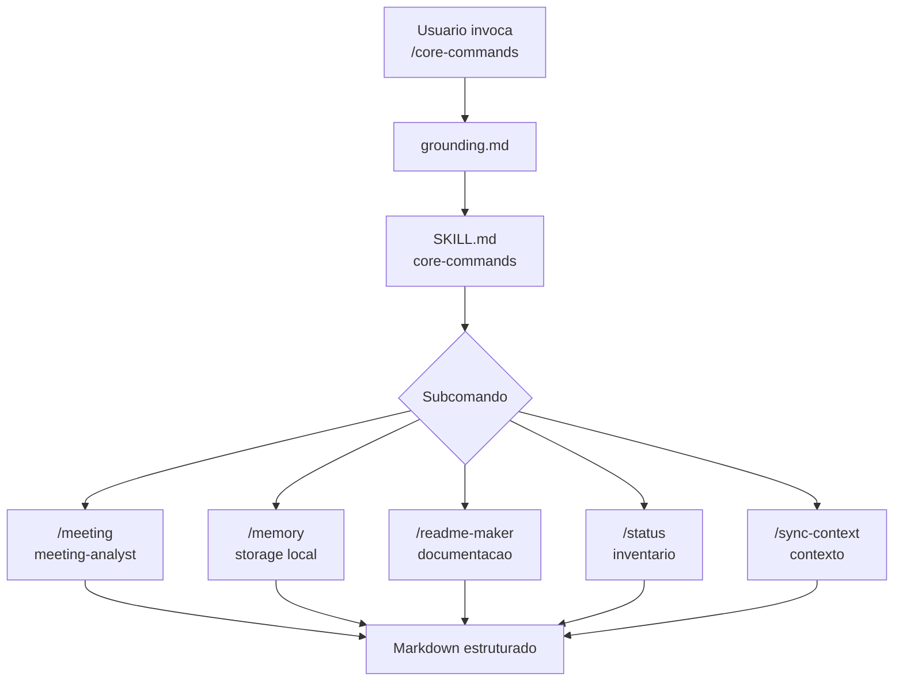

# Core Commands Skill

O skill `/core-commands` agrupa comandos operacionais de suporte ao uso diario do AgentSpec. Ele nao inicia fases SDD e nao substitui o router; sua funcao e cuidar de atividades transversais como leitura de status, memoria de sessao, analise de reunioes, sincronizacao de contexto e geracao de README. Por isso ele e tratado como uma camada de utilidade: ajuda o operador a manter contexto, transformar informacao dispersa em artefatos legiveis e consultar o estado do workspace sem entrar no fluxo formal de Brainstorm, Define, Design, Build ou Ship.

O motivo de existir um skill separado para comandos core e reduzir ambiguidade. Sem esse agrupamento, pedidos como "salve isso", "analise essa reuniao" ou "qual o status" poderiam cair em agentes de planejamento, revisao ou desenvolvimento. Ao exigir `/core-commands`, o runtime deixa claro que a intencao e administrativa e que o resultado esperado e documentacao, memoria ou relatorio de estado, nao implementacao.

## Comandos

| Comando | Papel | Saida esperada |
|---|---|---|
| `/core-commands /meeting` | Extrai decisoes, acoes, perguntas abertas e insights de atas ou transcricoes | Analise estruturada em Markdown |
| `/core-commands /memory` | Salva aprendizados relevantes da sessao em `.github/storage/` | Arquivo de memoria por data |
| `/core-commands /readme-maker` | Gera ou melhora README com foco em clareza operacional | README ou trecho de README |
| `/core-commands /status` | Resume o estado do AgentSpec e seus artefatos | Status de workspace |
| `/core-commands /sync-context` | Atualiza contexto persistente quando aplicavel | Contexto sincronizado |

## Fluxo

## Como usar bem

Use este skill quando a tarefa for sobre organizacao de informacao, manutencao de contexto ou leitura de estado. Ele nao deve ser usado para iniciar uma fase SDD, porque esse contrato pertence ao `/workflow-commands`. Tambem nao deve ser usado para criar KBs, porque esse dominio pertence ao `/knowledge-commands`.

O padrao recomendado e invocar o skill com o subcomando explicito e um alvo claro. Por exemplo, uma ata de reuniao deve ser passada como caminho de arquivo; uma memoria deve conter o resumo de alto valor; um status deve ser pedido sem misturar uma implementacao no mesmo comando. Isso mantem o comando pequeno, auditavel e previsivel.

