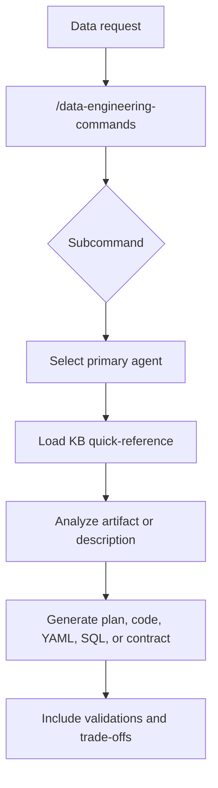

# Data Engineering Commands Skill

The `/data-engineering-commands` skill concentrates data engineering commands that require specialists, domain KBs, and technical artifacts. It exists to prevent pipeline, schema, quality, migration, or lakehouse requests from being treated as generic coding tasks. Instead, each subcommand points to an agent and knowledge domains that already encode local best practices.

This skill is especially important because data engineering often crosses multiple boundaries: modeling, orchestration, quality, contracts, cloud, SQL, streaming, and AI pipelines. The grouping reduces the chance of an incomplete solution — for example, creating a DAG without a freshness contract, a table without a partitioning strategy, or a migration without a compatibility plan.

## Commands

| Command | Focus | Common agents | Common KBs |
|---|---|---|---|
| `/pipeline` | Pipeline architecture and implementation | `pipeline-architect`, `airflow-specialist` | `airflow`, `streaming`, `modern-stack` |
| `/schema` | Dimensional modeling, Data Vault, SCD, and evolution | `schema-designer` | `data-modeling`, `sql-patterns` |
| `/data-quality` | Tests, expectations, SLAs, and observability | `data-quality-analyst` | `data-quality`, `dbt` |
| `/lakehouse` | Delta, Iceberg, catalogs, and governance | `lakehouse-architect` | `lakehouse`, `medallion` |
| `/sql-review` | SQL review and optimization | `sql-optimizer` | `sql-patterns` |
| `/ai-pipeline` | RAG, embeddings, feature store, and LLMOps | `ai-data-engineer` | `ai-data-engineering`, `genai` |
| `/data-contract` | ODCS contracts, SLA, and producer-consumer governance | `data-contracts-engineer` | `data-quality`, `data-modeling` |
| `/migrate` | Platform, schema, or pipeline migrations | Domain specialist | Target domain KB |

## Flow

## Why have a single skill

A single data engineering skill makes standardization easier. The outputs tend to need the same questions: source, destination, volume, SLA, partitioning, contract, incremental strategy, testing, and observability. Centralizing the commands reminds the operator that these elements are part of the work, not optional details.

At the same time, the skill does not become a monolithic agent. It is a command façade. The specialized work continues to be delegated to domain agents, and the agents continue to consult specific KBs. This design preserves two things simultaneously: a simple entry point for the user and specialized execution behind the scenes.
