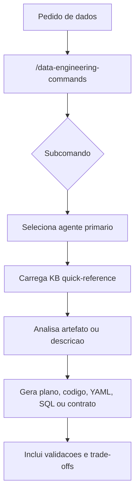

# Data Engineering Commands Skill

O skill `/data-engineering-commands` concentra comandos de engenharia de dados que exigem especialistas, KBs de dominio e artefatos tecnicos. Ele existe para impedir que pedidos de pipeline, schema, qualidade, migracao ou lakehouse sejam tratados como tarefas genericas de codigo. Em vez disso, cada subcomando aponta para um agente e para dominios de conhecimento que ja codificam boas praticas locais.

Esse skill e especialmente importante porque engenharia de dados costuma cruzar varias fronteiras: modelagem, orquestracao, qualidade, contratos, cloud, SQL, streaming e AI pipelines. O agrupamento reduz a chance de uma solucao incompleta, por exemplo criar um DAG sem contrato de freshness, uma tabela sem estrategia de particionamento ou uma migracao sem plano de compatibilidade.

## Comandos

| Comando | Foco | Agentes comuns | KBs comuns |
|---|---|---|---|
| `/pipeline` | Arquitetura e implementacao de pipelines | `pipeline-architect`, `airflow-specialist` | `airflow`, `streaming`, `modern-stack` |
| `/schema` | Modelagem dimensional, Data Vault, SCD e evolucao | `schema-designer` | `data-modeling`, `sql-patterns` |
| `/data-quality` | Testes, expectativas, SLAs e observabilidade | `data-quality-analyst` | `data-quality`, `dbt` |
| `/lakehouse` | Delta, Iceberg, catalogos e governanca | `lakehouse-architect` | `lakehouse`, `medallion` |
| `/sql-review` | Revisao e otimizacao de SQL | `sql-optimizer` | `sql-patterns` |
| `/ai-pipeline` | RAG, embeddings, feature store e LLMOps | `ai-data-engineer` | `ai-data-engineering`, `genai` |
| `/data-contract` | Contratos ODCS, SLA e governanca produtor-consumidor | `data-contracts-engineer` | `data-quality`, `data-modeling` |
| `/migrate` | Migracoes de plataforma, schema ou pipeline | Especialista por dominio | KB do dominio alvo |

## Fluxo

## Por que ter um skill unico

Um unico skill de engenharia de dados facilita padronizacao. As saidas tendem a precisar das mesmas perguntas: fonte, destino, volume, SLA, particionamento, contrato, estrategia incremental, teste e observabilidade. Centralizar os comandos faz o operador lembrar que esses elementos sao parte do trabalho e nao detalhes opcionais.

Ao mesmo tempo, o skill nao vira um agente monolitico. Ele e uma fachada de comandos. O trabalho especializado continua sendo delegado aos agentes de dominio, e os agentes continuam consultando KBs especificas. Esse desenho preserva duas coisas ao mesmo tempo: entrada simples para o usuario e execucao especializada por tras.

