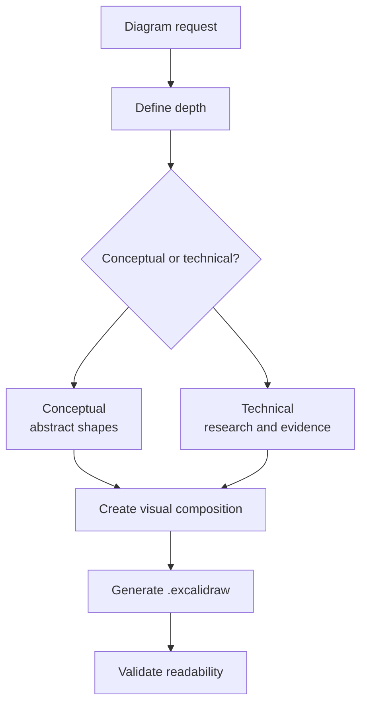

# Excalidraw Diagram Skill

The `/excalidraw-diagram` skill creates `.excalidraw` diagrams to explain architecture, flow, concepts, or decisions. It is not merely a box-and-arrow generator; its central rule is that the diagram must make a visual argument. The structure, groupings, arrows, and concrete examples must carry meaning even before the full text is read.

It exists because some problems are better understood as topology, sequence, dependency, or contrast. A README can explain that grounding comes before routing, but a diagram shows the order, the blocks, and the exceptions immediately. In systems with agents, skills, KBs, and workflow, this type of visualization reduces operational ambiguity.

## Principles

| Principle | Practical effect |
|---|---|
| Isomorphism | Shape should reflect system behavior |
| Concrete evidence | Technical diagrams must show real examples of payload, command, file, or event |
| Multi-level | Combine overview, regions, and internal details |
| Purposeful text | Avoid decorative blocks that only repeat what the title already said |
| Visual validation | Generate a usable and readable file, not just valid JSON |

## Flow

## When to use

Use when the question involves architecture, workflow, dependency, option comparison, explanation for others, or visual documentation. Avoid when a table or a small Mermaid in Markdown would work better, especially if the destination is text-based versioned documentation in `docs/`.
