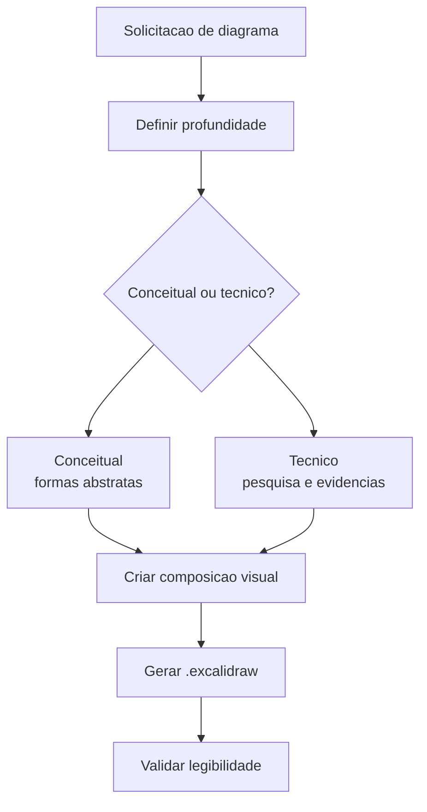

# Excalidraw Diagram Skill

O skill `/excalidraw-diagram` cria diagramas `.excalidraw` para explicar arquitetura, fluxo, conceito ou decisao. Ele nao e apenas um gerador de caixas e setas; sua regra central e que o diagrama precisa argumentar visualmente. A estrutura, os agrupamentos, as setas e os exemplos concretos devem carregar significado mesmo antes da leitura de todo o texto.

Ele existe porque alguns problemas sao mais bem entendidos como topologia, sequencia, dependencia ou contraste. Um README pode explicar que grounding vem antes de routing, mas um diagrama mostra a ordem, os bloqueios e as excecoes de forma imediata. Em sistemas com agentes, skills, KBs e workflow, esse tipo de visualizacao reduz ambiguidade operacional.

## Principios

| Principio | Efeito pratico |
|---|---|
| Isomorfismo | A forma deve refletir o comportamento do sistema |
| Evidencia concreta | Diagramas tecnicos devem mostrar exemplos reais de payload, comando, arquivo ou evento |
| Multinivel | Combinar visao geral, regioes e detalhes internos |
| Texto com proposito | Evitar blocos decorativos que so repetem o que o titulo ja disse |
| Validacao visual | Gerar arquivo utilizavel e legivel, nao apenas JSON valido |

## Fluxo

## Quando usar

Use quando a pergunta envolver arquitetura, workflow, dependencia, comparacao de opcoes, explicacao para terceiros ou documentacao visual. Evite quando uma tabela ou um pequeno Mermaid em Markdown resolver melhor, especialmente se o destino for documentacao textual versionada em `docs/`.

