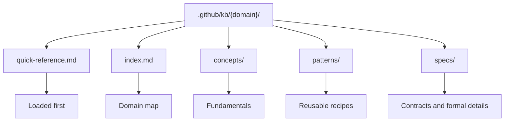

# Knowledge Commands Skill

The `/knowledge-commands` skill manages local KBs. It exists to create, update, and review knowledge domains without mixing that work with feature implementation. A KB in AgentSpec is not a loose wiki: it is an operational dependency for agents, used to reduce implicit memory, standardize decisions, and make technical responses more reproducible.

The central point of this skill is to separate reusable knowledge from feature artifacts. A DEFINE or DESIGN documents a specific need; a KB documents patterns that should survive across multiple features. When a dbt, Airflow, Spark, container, or data contract pattern becomes recurring, it should migrate to KB so that the router and agents can reuse it.

## Commands

| Command | Role |
|---|---|
| `/knowledge-commands /create-kb` | Creates a new KB domain with minimal structure |
| `/knowledge-commands /update-kb` | Updates an existing domain with new patterns |
| `/knowledge-commands /refresh-stale-kbs` | Reviews outdated or misaligned KBs |

## Expected structure

## Why this matters

Without KB, each agent would depend on long prompts or memory-held knowledge. With KB, the repository gains a local source of patterns. This also helps with quality review: if an implementation diverges from the `quick-reference.md` pattern, the build report should record the decision or correct the file.

KBs should be small at the entry point and deep on demand. The `quick-reference.md` is the entry door; full files should only be loaded when the quick reference is insufficient. This design controls token usage and prevents simple responses from carrying too much knowledge.
