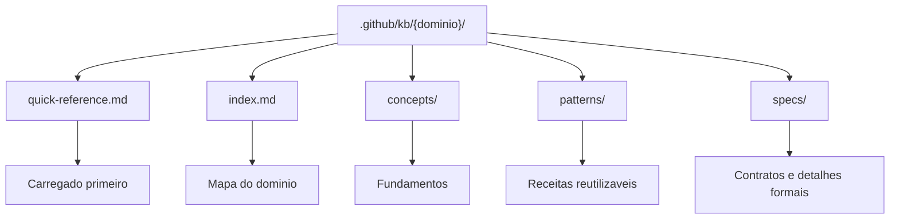

# Knowledge Commands Skill

O skill `/knowledge-commands` administra KBs locais. Ele existe para criar, atualizar e revisar dominios de conhecimento sem misturar esse trabalho com implementacao de feature. Uma KB no AgentSpec nao e uma wiki solta: ela e uma dependencia operacional dos agentes, usada para reduzir memoria implicita, padronizar decisoes e tornar respostas tecnicas mais reprodutiveis.

O ponto central desse skill e separar conhecimento reutilizavel de artefato de feature. Um DEFINE ou DESIGN documenta uma necessidade especifica; uma KB documenta padroes que devem sobreviver a varias features. Quando um padrao de dbt, Airflow, Spark, containers ou contratos de dados passa a ser recorrente, ele deve migrar para KB para que o router e os agentes possam reutiliza-lo.

## Comandos

| Comando | Papel |
|---|---|
| `/knowledge-commands /create-kb` | Cria novo dominio de KB com estrutura minima |
| `/knowledge-commands /update-kb` | Atualiza dominio existente com novos padroes |
| `/knowledge-commands /refresh-stale-kbs` | Revisa KBs antigas ou desalinhadas |

## Estrutura esperada

## Por que isso importa

Sem KB, cada agente dependeria de prompts longos ou conhecimento de memoria. Com KB, o reposititorio passa a ter uma fonte local de padroes. Isso tambem ajuda a revisar qualidade: se uma implementacao diverge do padrao de `quick-reference.md`, o build report deve registrar a decisao ou corrigir o arquivo.

KBs devem ser pequenas na entrada e profundas sob demanda. O `quick-reference.md` e a porta de entrada; arquivos completos so devem ser carregados quando a referencia rapida for insuficiente. Esse desenho controla tokens e evita que respostas simples carreguem conhecimento demais.
