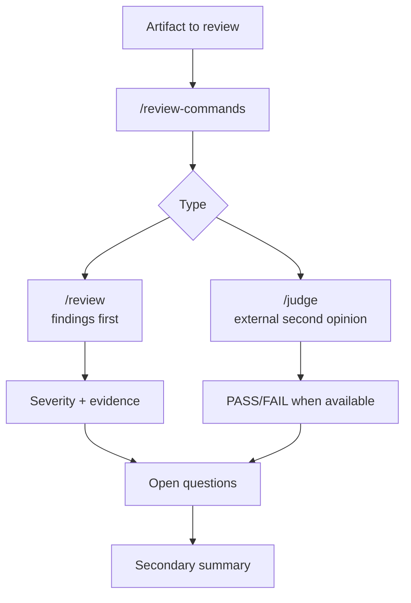

# Review Commands Skill

The `/review-commands` skill concentrates technical review. It exists to separate the author posture from the reviewer posture. When a user requests a review, the expected behavior changes: the response must prioritize bugs, risks, behavioral regression, security, incorrect data, and test gaps before any summary.

The skill also documents the judge concept, which is a second opinion for higher-risk outputs. In this workspace, the local judge runtime in `scripts/archive` has been removed; therefore any judge flow should be treated as an external or future capability, not a locally available script.

## Commands

| Command | Role |
|---|---|
| `/review-commands /review` | Direct review of a file, diff, or artifact |
| `/review-commands /judge` | Second opinion when an external runtime is configured |

## Review flow

## Criteria

A good review cites file and line, describes the behavior that breaks, explains the impact, and suggests a concrete fix. It should not spend the first part praising the code or retelling what the diff does. The summary comes after the findings, because the priority is to enable immediate action.

Use the judge only for high-risk material: DDL, IAM, RLS, complex SQL, Terraform, data contracts, or workflows that could affect production. For simple documentation, renames, or formatting, a normal review is sufficient.
