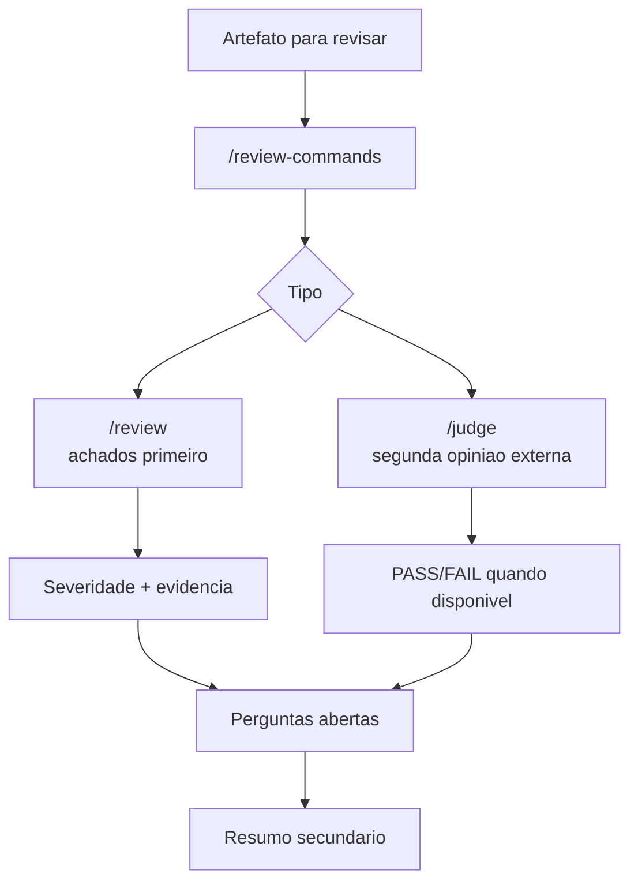

# Review Commands Skill

O skill `/review-commands` concentra revisao tecnica. Ele existe para separar a postura de autor da postura de revisor. Quando um usuario pede revisao, o comportamento esperado muda: a resposta deve priorizar bugs, riscos, regressao comportamental, seguranca, dados incorretos e lacunas de teste antes de qualquer resumo.

O skill tambem documenta o conceito de judge, que e uma segunda opiniao para saidas de maior risco. Neste workspace, o runtime local de judge em `scripts/archive` foi removido; portanto qualquer fluxo de judge deve ser tratado como capacidade externa ou futura, nao como script local disponivel.

## Comandos

| Comando | Papel |
|---|---|
| `/review-commands /review` | Revisao direta de arquivo, diff ou artefato |
| `/review-commands /judge` | Segunda opiniao quando houver runtime externo configurado |

## Fluxo de revisao

## Criterios

Uma boa revisao cita arquivo e linha, descreve o comportamento que quebra, explica impacto e sugere correcao concreta. Ela nao deve gastar a primeira parte elogiando o codigo ou recontando o que o diff faz. O resumo vem depois dos achados, porque a prioridade e permitir acao imediata.

Use o judge apenas para material de risco: DDL, IAM, RLS, SQL complexo, Terraform, contratos de dados ou workflow que possa afetar producao. Para documentacao simples, renomeacoes ou formatacao, a revisao normal e suficiente.

