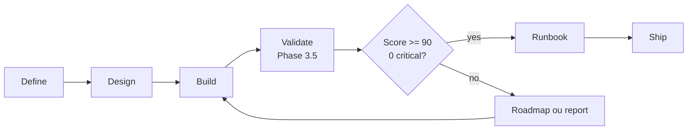

# Validate Skill

O skill `/validate` e a fase 3.5 do SDD AgentSpec. Ele fica obrigatoriamente entre Build e Ship. A funcao dele e transformar evidencias de implementacao em uma decisao de qualidade: a feature esta pronta para producao, precisa de remediation roadmap ou deve permanecer bloqueada.

Ele existe porque `/build` e `/ship` respondem perguntas diferentes. Build pergunta "os arquivos do DESIGN foram implementados e verificados localmente?". Validate pergunta "a implementacao resultante ainda satisfaz o DEFINE, respeita o DESIGN, tem qualidade tecnica aceitavel, cobre seguranca/devops e possui prontidao operacional?". Ship so deve arquivar depois que essa segunda pergunta tiver resposta documentada.

## Posicao no fluxo

## Entradas

| Artefato | Caminho |
|---|---|
| Requisitos | `.github/sdd/features/{feature-name}/DEFINE_{FEATURE}.md` |
| Design | `.github/sdd/features/{feature-name}/DESIGN_{FEATURE}.md` |
| Build report | `.github/sdd/features/{feature-name}/BUILD_REPORT_{FEATURE}.md` |
| Codigo | `projects/{feature-name}/` |

## Saidas

| Saida | Quando e gerada |
|---|---|
| `VALIDATION_REPORT_{FEATURE}.md` | Sempre |
| `RUNBOOK_{FEATURE}.md` | Score >= 90 e zero CRITICAL |
| `ROADMAP_{FEATURE}.md` | Score 70-89 e zero CRITICAL |

## Dimensoes

| Dimensao | Peso |
|---|---:|
| Spec Alignment | 30% |
| Code Quality | 25% |
| Architecture Fidelity | 20% |
| Security & DevOps | 15% |
| Production Readiness | 10% |

## Regra de Ship

Ship deve exigir `VALIDATION_REPORT_{FEATURE}.md` e deve bloquear se houver CRITICAL issue ou score abaixo de 90. Quando o resultado e remediation, o caminho correto e corrigir a implementacao, atualizar `BUILD_REPORT` quando necessario e rodar `/workflow-commands /validate` novamente.
