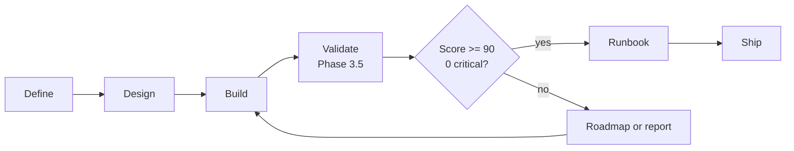

# Validate Skill

The `/validate` skill is phase 3.5 of the SDD AgentSpec. It sits mandatorily between Build and Ship. Its function is to transform implementation evidence into a quality decision: the feature is ready for production, needs a remediation roadmap, or must remain blocked.

It exists because `/build` and `/ship` answer different questions. Build asks "were the DESIGN files implemented and locally verified?". Validate asks "does the resulting implementation still satisfy the DEFINE, respect the DESIGN, have acceptable technical quality, cover security/devops, and possess operational readiness?". Ship should only archive after that second question has a documented answer.

## Position in the flow

## Inputs

| Artifact | Path |
|---|---|
| Requirements | `.github/sdd/features/{feature-name}/DEFINE_{FEATURE}.md` |
| Design | `.github/sdd/features/{feature-name}/DESIGN_{FEATURE}.md` |
| Build report | `.github/sdd/features/{feature-name}/BUILD_REPORT_{FEATURE}.md` |
| Code | `projects/{feature-name}/` |

## Outputs

| Output | When generated |
|---|---|
| `VALIDATION_REPORT_{FEATURE}.md` | Always |
| `RUNBOOK_{FEATURE}.md` | Score >= 90 and zero CRITICAL |
| `ROADMAP_{FEATURE}.md` | Score 70-89 and zero CRITICAL |

## Dimensions

| Dimension | Weight |
|---|---:|
| Spec Alignment | 30% |
| Code Quality | 25% |
| Architecture Fidelity | 20% |
| Security & DevOps | 15% |
| Production Readiness | 10% |

## Ship Rule

Ship must require `VALIDATION_REPORT_{FEATURE}.md` and must block if there is a CRITICAL issue or a score below 90. When the result is remediation, the correct path is to fix the implementation, update `BUILD_REPORT` when necessary, and run `/workflow-commands /validate` again.
