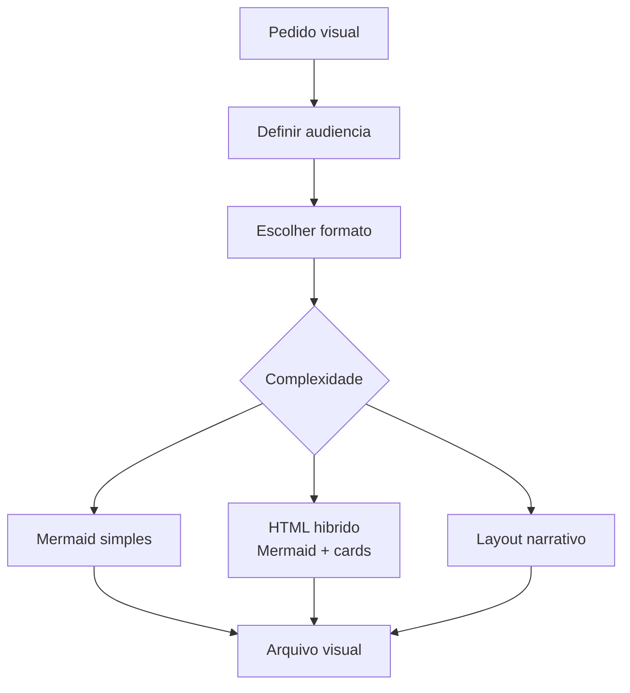

# Visual Explainer Skill

O skill `/visual-explainer` gera explicacoes visuais em HTML, slides, diagramas, recaps e fact checks. Ele existe para transformar conceitos tecnicos em artefatos navegaveis, com hierarquia visual, Mermaid quando adequado e componentes de leitura mais ricos que um Markdown simples.

Enquanto `/excalidraw-diagram` produz arquivos Excalidraw, o visual explainer costuma produzir paginas HTML autoexplicativas. Isso e util para apresentar arquitetura, onboarding, material executivo, comparacoes e narrativas tecnicas que precisam combinar texto, diagramas, tabelas e destaques.

## Saidas comuns

| Tipo | Uso |
|---|---|
| Web diagram | Arquitetura ou fluxo navegavel em HTML |
| Visual plan | Plano tecnico com secoes e diagramas |
| Slides | Apresentacao curta e visual |
| Fact check | Checagem estruturada de alegacoes |
| Recap | Resumo visual de reuniao, decisao ou projeto |

## Fluxo

## Criterios de qualidade

O arquivo visual deve ser legivel, responsivo e fiel ao dominio. Diagramas complexos nao devem ser espremidos em um unico Mermaid ilegivel; e melhor combinar uma visao topologica pequena com detalhes em secoes. As cores, tipografia e espacamento precisam apoiar a compreensao, nao apenas decorar.

Use este skill quando o publico precisa entender relacoes, riscos e decisoes rapidamente. Para documentacao de referencia permanente em `docs/`, Markdown com Mermaid costuma ser mais facil de versionar; para apresentacao, ensino e alinhamento, HTML visual e melhor.

