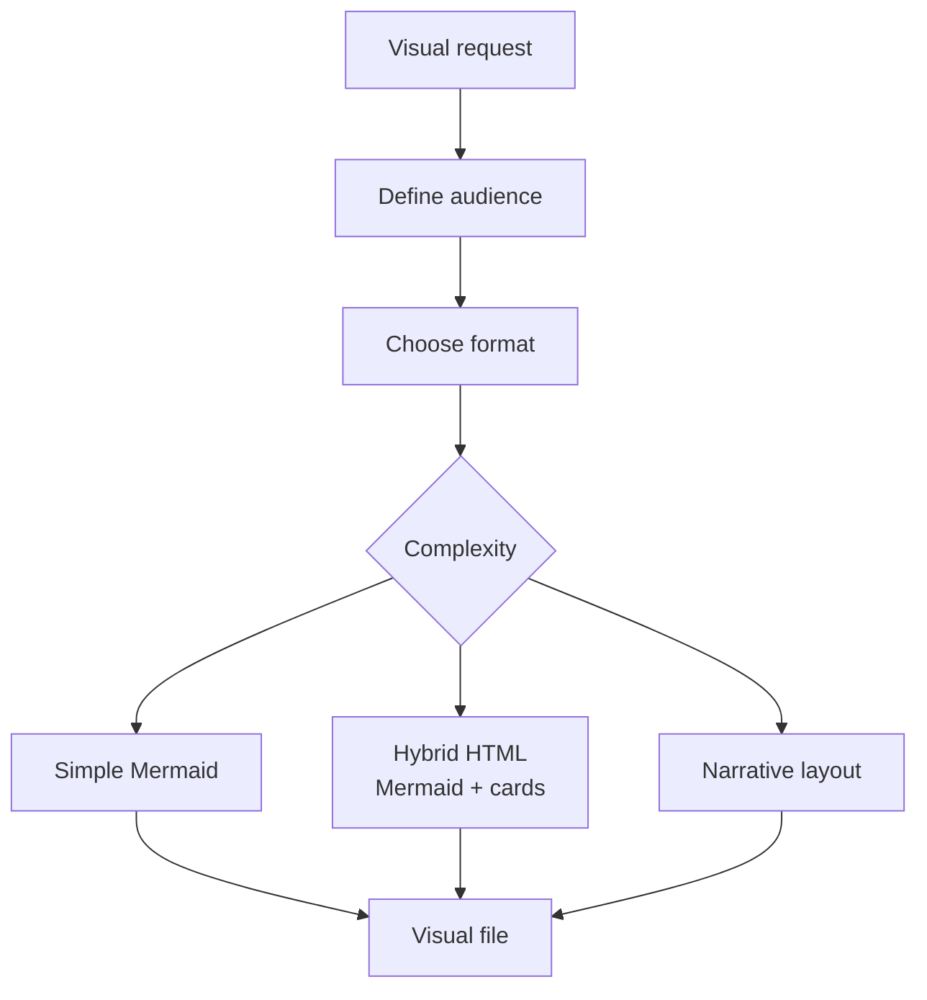

# Visual Explainer Skill

The `/visual-explainer` skill generates visual explanations in HTML, slides, diagrams, recaps, and fact checks. It exists to transform technical concepts into navigable artifacts, with visual hierarchy, Mermaid when appropriate, and richer reading components than plain Markdown.

While `/excalidraw-diagram` produces Excalidraw files, the visual explainer typically produces self-explanatory HTML pages. This is useful for presenting architecture, onboarding, executive material, comparisons, and technical narratives that need to combine text, diagrams, tables, and highlights.

## Common outputs

| Type | Use |
|---|---|
| Web diagram | Architecture or navigable flow in HTML |
| Visual plan | Technical plan with sections and diagrams |
| Slides | Short, visual presentation |
| Fact check | Structured verification of claims |
| Recap | Visual summary of a meeting, decision, or project |

## Flow

## Quality criteria

The visual file must be readable, responsive, and faithful to the domain. Complex diagrams should not be squeezed into a single unreadable Mermaid; it is better to combine a small topological view with details in sections. Colors, typography, and spacing must support comprehension, not just decoration.

Use this skill when the audience needs to understand relationships, risks, and decisions quickly. For permanent reference documentation in `docs/`, Markdown with Mermaid is usually easier to version; for presentation, teaching, and alignment, visual HTML is better.
