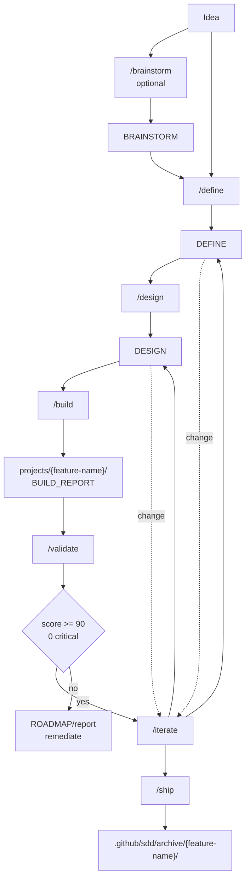

# Workflow Commands Skill

The `/workflow-commands` skill is the mandatory entry point for the SDD in AgentSpec. It exists to ensure that Brainstorm, Define, Design, Build, Validate, Ship, and Iterate happen with predictable gates, paths, and artifacts. No SDD phase should be started through natural language or by directly calling a workflow agent; the user must invoke `/workflow-commands /<phase>`.

This restriction is not bureaucratic. It preserves traceability. A build should only arise from a design; a design should only arise from a define; a ship should only occur when the artifacts and validations exist. The skill is the contract that prevents an implementation from appearing without a requirement, without an architectural decision, or without a report.

## Phases

| Phase | Command | Input | Output |
|---|---|---|---|
| 0 | `/workflow-commands /brainstorm` | Idea, problem, or notes | `BRAINSTORM_{FEATURE}.md` |
| 1 | `/workflow-commands /define` | Direct input or brainstorm | `DEFINE_{FEATURE}.md` |
| 2 | `/workflow-commands /design` | `DEFINE_{FEATURE}.md` | `DESIGN_{FEATURE}.md` |
| 3 | `/workflow-commands /build` | `DESIGN_{FEATURE}.md` | Code in `projects/{feature-name}/` and `BUILD_REPORT_{FEATURE}.md` |
| 3.5 | `/workflow-commands /validate` | Define, design, build report, and code | `VALIDATION_REPORT_{FEATURE}.md` + `RUNBOOK` or `ROADMAP` |
| 4 | `/workflow-commands /ship` | Define, design, build report, approved validation, and runbook | `SHIPPED_{DATE}.md` file in archive |
| X | `/workflow-commands /iterate` | Existing SDD document | Updated document with history |

## Flow

## Core rules

All active artifacts live in `.github/sdd/features/{feature-name}/`, while implementation generated by build lives in `projects/{feature-name}/`. Build reports remain alongside the feature SDD, not inside `projects/`. Shipped features are archived in `.github/sdd/archive/{feature-name}/`.

During build, manifest lines with `@{agent-name}` must be delegated to the corresponding specialist. The build must read the agent file, load the required KB reference, and record evidence in the `BUILD_REPORT`. This transforms delegation into a verifiable contract, not an informal preference.

After Build, Validate is mandatory. Ship must block any feature without `VALIDATION_REPORT_{FEATURE}.md`, with a score below 90, with CRITICAL issues, or without `RUNBOOK_{FEATURE}.md`.
