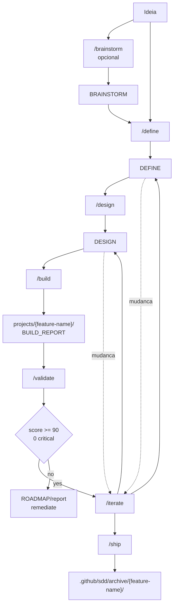

# Workflow Commands Skill

O skill `/workflow-commands` e a entrada obrigatoria para o SDD do AgentSpec. Ele existe para garantir que Brainstorm, Define, Design, Build, Validate, Ship e Iterate acontecam com gates, caminhos e artefatos previsiveis. Nenhuma fase SDD deve ser iniciada por linguagem natural ou por chamada direta a um agente de workflow; o usuario precisa invocar `/workflow-commands /<fase>`.

Essa restricao nao e burocratica. Ela preserva rastreabilidade. Um build so deve nascer de um design; um design so deve nascer de um define; um ship so deve ocorrer quando os artefatos e validacoes existem. O skill e o contrato que impede uma implementacao de aparecer sem requisito, sem decisao arquitetural ou sem relatorio.

## Fases

| Fase | Comando | Entrada | Saida |
|---|---|---|---|
| 0 | `/workflow-commands /brainstorm` | Ideia, problema ou notas | `BRAINSTORM_{FEATURE}.md` |
| 1 | `/workflow-commands /define` | Input direto ou brainstorm | `DEFINE_{FEATURE}.md` |
| 2 | `/workflow-commands /design` | `DEFINE_{FEATURE}.md` | `DESIGN_{FEATURE}.md` |
| 3 | `/workflow-commands /build` | `DESIGN_{FEATURE}.md` | Codigo em `projects/{feature-name}/` e `BUILD_REPORT_{FEATURE}.md` |
| 3.5 | `/workflow-commands /validate` | Define, design, build report e codigo | `VALIDATION_REPORT_{FEATURE}.md` + `RUNBOOK` ou `ROADMAP` |
| 4 | `/workflow-commands /ship` | Define, design, build report, validacao aprovada e runbook | Arquivo `SHIPPED_{DATE}.md` em archive |
| X | `/workflow-commands /iterate` | Documento SDD existente | Documento atualizado com historico |

## Fluxo

## Regras centrais

Todos os artefatos ativos vivem em `.github/sdd/features/{feature-name}/`, enquanto implementacao gerada por build vive em `projects/{feature-name}/`. Relatorios de build permanecem junto ao SDD da feature, nao dentro de `projects/`. Features enviadas sao arquivadas em `.github/sdd/archive/{feature-name}/`.

Durante build, linhas de manifesto com `@{agent-name}` precisam ser delegadas para o especialista correspondente. O build deve ler o arquivo do agente, carregar a referencia KB exigida e registrar evidencia no `BUILD_REPORT`. Isso transforma delegacao em contrato verificavel, nao em preferencia informal.

Depois do Build, Validate e obrigatorio. Ship deve bloquear qualquer feature sem `VALIDATION_REPORT_{FEATURE}.md`, com score abaixo de 90, com CRITICAL issues ou sem `RUNBOOK_{FEATURE}.md`.
