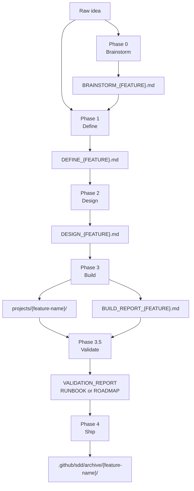
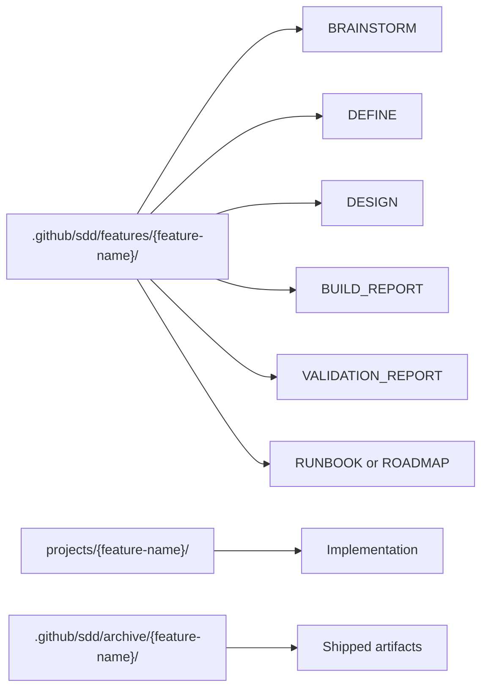
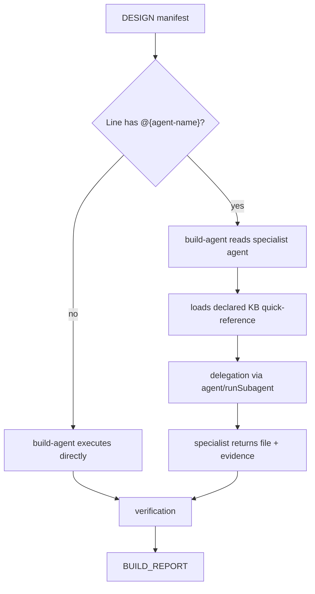

# Workflow, Contracts and Architecture

The AgentSpec SDD lives in `.github/sdd/` and organizes development into traceable phases. The formal architecture appears in `.github/sdd/architecture/`, especially `WORKFLOW_CONTRACTS.yaml`, which describes phases, agents, inputs, outputs, gates, templates, and transition rules. The Validate phase is mandatory between Build and Ship.

Having workflow and contracts separate from implementation is essential to avoid code without specification. The runtime treats SDD documents as the source of truth: Define explains what and why, Design explains how, Build executes the manifest, and Ship archives with evidence. This chain allows reviewing a decision without relying solely on the final diff.

## SDD pipeline

## Contracts per phase

| Phase | Required input | Required output | Main gate |
|---|---|---|---|
| Brainstorm | Idea, problem, or notes | `BRAINSTORM_{FEATURE}.md` | Questions, samples, approaches, and YAGNI |
| Define | Direct input or brainstorm | `DEFINE_{FEATURE}.md` | Sufficient clarity and defined scope |
| Design | `DEFINE_{FEATURE}.md` | `DESIGN_{FEATURE}.md` | Decisions, architecture, manifest, and tests |
| Build | `DESIGN_{FEATURE}.md` | Code + `BUILD_REPORT_{FEATURE}.md` | All manifest files and evidence |
| Validate | Define, design, build report, and code | `VALIDATION_REPORT_{FEATURE}.md` + `RUNBOOK` or `ROADMAP` | Score >= 90 and zero CRITICAL to Ship |
| Ship | Complete artifacts and approved validation | `SHIPPED_{DATE}.md` | Complete build, approved validation, runbook, and no blockers |
| Iterate | Existing SDD document | Same document updated | Cascade analysis and history |

## Canonical paths

Build output must go to `projects/{feature-name}/`. Build reports stay alongside the feature in `.github/sdd/features/{feature-name}/` until ship. This separation avoids mixing specification, reports, and runtime.

## Delegation architecture

The contract protects against two errors: writing implementation outside `projects/` and delegating without evidence. Each specialist must leave verifiable traces in the build report, especially for containers, dbt, Airflow, Python, and other domains with their own gates.

## Architectural files

| File | Role |
|---|---|
| `.github/sdd/architecture/ARCHITECTURE.md` | Visual and conceptual overview of the workflow |
| `.github/sdd/architecture/WORKFLOW_CONTRACTS.yaml` | Structured contract of phases, gates, and artifacts |
| `.github/sdd/templates/*.md` | Templates used by the phases |
| `.github/sdd/features/` | Features in progress |
| `.github/sdd/archive/` | Shipped features |
