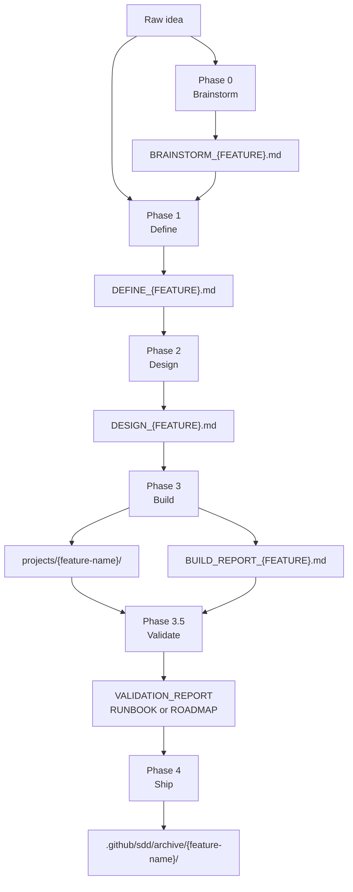
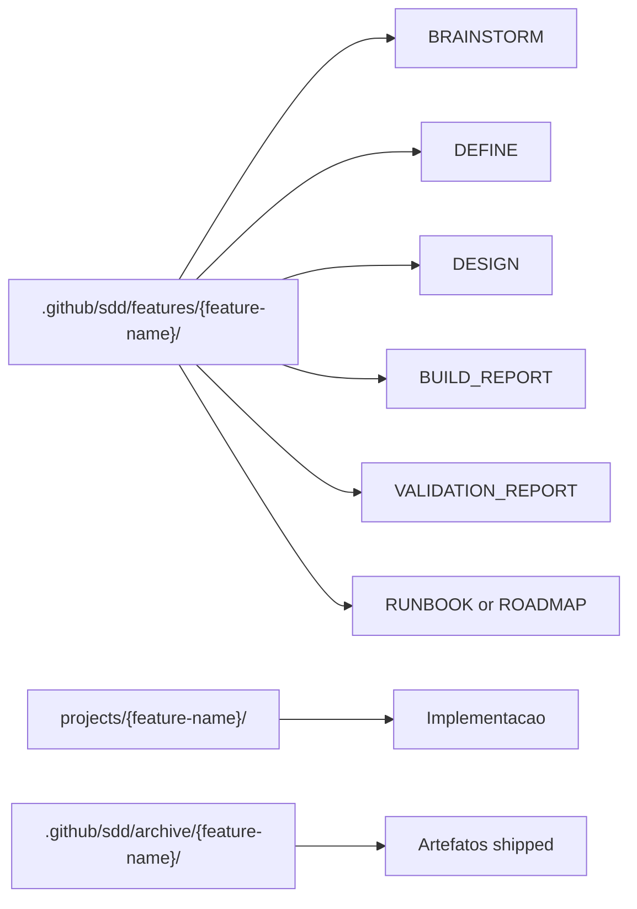
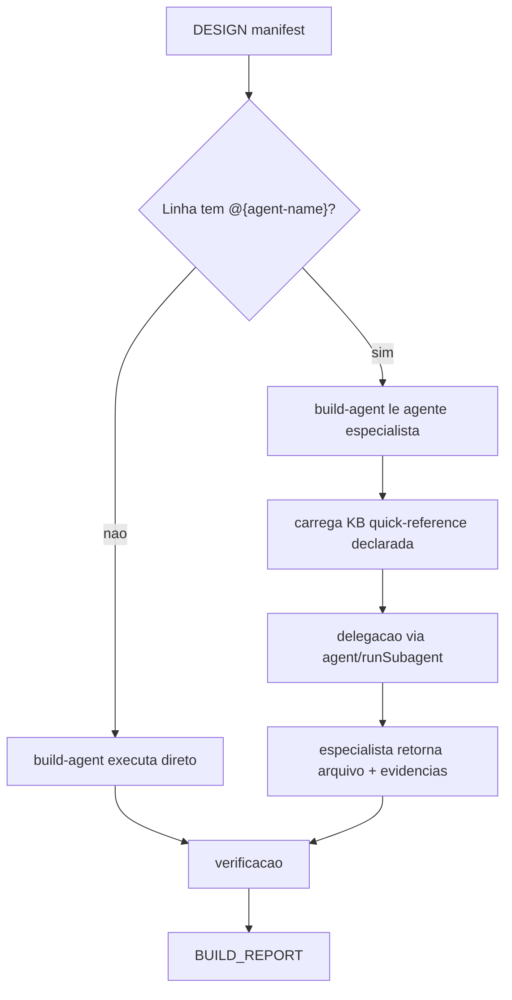

# Workflow, Contracts and Architecture

O SDD do AgentSpec vive em `.github/sdd/` e organiza desenvolvimento em fases rastreaveis. A arquitetura formal aparece em `.github/sdd/architecture/`, especialmente `WORKFLOW_CONTRACTS.yaml`, que descreve fases, agentes, entradas, saidas, gates, templates e regras de transicao. A fase Validate e obrigatoria entre Build e Ship.

Ter workflow e contratos separados da implementacao e essencial para evitar codigo sem especificacao. O runtime trata documentos SDD como fonte de verdade: Define explica o que e por que, Design explica como, Build executa o manifesto e Ship arquiva com evidencias. Essa cadeia permite revisar uma decisao sem depender apenas do diff final.

## Pipeline SDD

## Contratos por fase

| Fase | Entrada obrigatoria | Saida obrigatoria | Gate principal |
|---|---|---|---|
| Brainstorm | Ideia, problema ou notas | `BRAINSTORM_{FEATURE}.md` | Perguntas, amostras, abordagens e YAGNI |
| Define | Input direto ou brainstorm | `DEFINE_{FEATURE}.md` | Clareza suficiente e escopo definido |
| Design | `DEFINE_{FEATURE}.md` | `DESIGN_{FEATURE}.md` | Decisoes, arquitetura, manifest e testes |
| Build | `DESIGN_{FEATURE}.md` | Codigo + `BUILD_REPORT_{FEATURE}.md` | Todos os arquivos do manifest e evidencias |
| Validate | Define, design, build report e codigo | `VALIDATION_REPORT_{FEATURE}.md` + `RUNBOOK` ou `ROADMAP` | Score >= 90 e zero CRITICAL para Ship |
| Ship | Artefatos completos e validacao aprovada | `SHIPPED_{DATE}.md` | Build completo, validacao aprovada, runbook e sem bloqueios |
| Iterate | Documento SDD existente | Mesmo documento atualizado | Analise de cascata e historico |

## Caminhos canonicos

Build output deve ir para `projects/{feature-name}/`. Build reports ficam junto da feature em `.github/sdd/features/{feature-name}/` ate o ship. Essa separacao evita misturar especificacao, relatorio e runtime.

## Arquitetura de delegacao

O contrato protege contra dois erros: escrever implementacao fora de `projects/` e delegar sem evidencia. Cada especialista precisa deixar rastros verificaveis no build report, especialmente para containers, dbt, Airflow, Python e outros dominios com gates proprios.

## Arquivos arquiteturais

| Arquivo | Papel |
|---|---|
| `.github/sdd/architecture/ARCHITECTURE.md` | Visao visual e conceitual do workflow |
| `.github/sdd/architecture/WORKFLOW_CONTRACTS.yaml` | Contrato estruturado das fases, gates e artefatos |
| `.github/sdd/templates/*.md` | Templates usados pelas fases |
| `.github/sdd/features/` | Features em andamento |
| `.github/sdd/archive/` | Features shipped |
