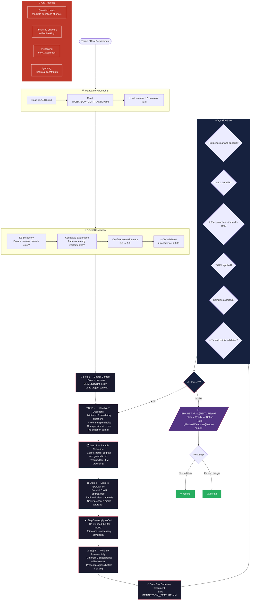

# Phase 0 — BRAINSTORM

## Quick Rules

| # | Rule |
| --- | --- |
| 1 | Minimum **3 discovery questions** |
| 2 | Always **multiple choice** in questions |
| 3 | Present **2–3 approaches** with trade-offs |
| 4 | Apply **YAGNI** — cut what is not MVP |
| 5 | **≥ 2 validation checkpoints** with the user |
| 6 | Confidence threshold: **0.85** |
| 7 | Never do a question dump — **one question at a time** |
