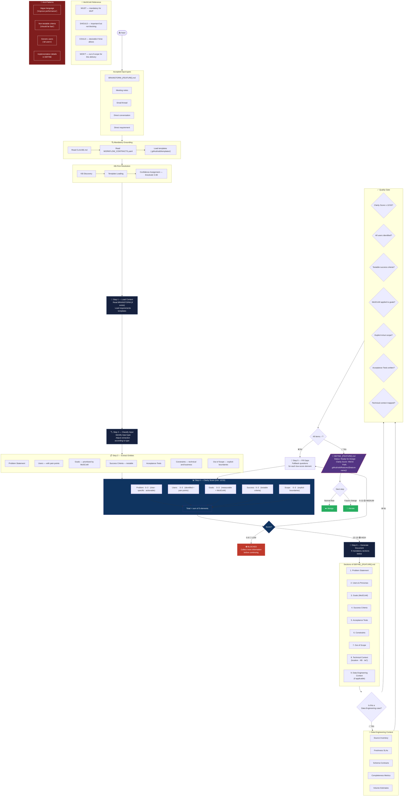

# Phase 1 — DEFINE

## Quick Rules

| # | Rule |
| --- | --- |
| 1 | **Minimum Clarity Score: 12/15** to advance |
| 2 | Score 9–11: fill gaps before continuing |
| 3 | Score 0–8: **blocked**, collect more info |
| 4 | All goals must have **MoSCoW** |
| 5 | Success Criteria must be **testable** |
| 6 | Out of Scope must be **explicit** |
| 7 | `/design` **cannot start** without this document |
| 8 | Confidence threshold: **0.90** |

## Clarity Score — Scoring Guide

| Element | 0 | 1 | 2 | 3 |
| --- | --- | --- | --- | --- |
| Problem | Absent | Vague | Specific | Clear + actionable |
| Users | Absent | Generic | Identified | With pain points |
| Goals | Absent | Vague | Measurable | MoSCoW applied |
| Success | Absent | Subjective | Objective | Automatically testable |
| Scope | Absent | Implicit | Partial | Explicit in/out |
