# Phase 2 — DESIGN

```mermaid
flowchart TD
    START(["📄 DEFINE_{FEATURE}.md"])

    START --> MANDATORY_GATE{"🔒 MANDATORY GATE
    DEFINE_{FEATURE}.md exists?"}

    MANDATORY_GATE -->|"❌ NO"| BLOCK["⛔ BLOCKED
    Run /define first"]

    MANDATORY_GATE -->|"✅ YES"| G

    subgraph G["🔍 Mandatory Grounding"]
        G1["Read CLAUDE.md"] --> G2["Read WORKFLOW_CONTRACTS.yaml"]
        G2 --> G3["Load routing.json"]
    end

    G --> KB

    subgraph KB["KB-First Resolution — threshold: 0.95"]
        KB1["1. KB Pattern Loading\n(patterns relevant to the domain)"]
        KB2["2. Agent Discovery\n(routing.json — agent per type)"]
        KB3["3. Confidence Assignment"]
        KB4["4. MCP Validation\nif confidence < 0.95"]
        KB1 --> KB2 --> KB3 --> KB4
    end

    KB --> S1

    S1["📂 Step 1 — Load Context
    Read DEFINE_{FEATURE}.md in full
    Load KB domains for the problem
    Map existing dependencies"]

    S1 --> S2

    S2["🏛️ Step 2 — Create Architecture
    Mandatory ASCII diagram
    Justified component decisions
    Technology stack with rationale
    Integration strategy"]

    S2 --> ADR

    subgraph ADR["📝 Step 3 — Inline ADR (one per critical decision)"]
        direction TB
        ADR1["Status:               Proposed | Accepted | Deprecated | Superseded"]
        ADR2["Date:                 YYYY-MM-DD"]
        ADR3["Context:              situation forcing the decision"]
        ADR4["Choice:               decision made"]
        ADR5["Rationale:            why this choice"]
        ADR6["Alternatives Rejected: what was discarded and why"]
        ADR7["Consequences:         impacts and trade-offs"]
    end

    ADR --> S4

    S4["📁 Step 4 — File Manifest
    Complete table of all files"]

    subgraph MANIFEST["File Manifest Structure"]
        direction LR
        M1["# — sequential number"]
        M2["file_path — relative path"]
        M3["action — CREATE | MODIFY | DELETE | READ"]
        M4["purpose — what it does"]
        M5["dependencies — depends on what"]
    end

    S4 --> MANIFEST
    MANIFEST --> S5

    subgraph S5["🤖 Step 5 — Agent Matching (via routing.json)"]
        direction TB
        AM1["File Type        → weight HIGH"]
        AM2["Purpose Keywords → weight HIGH"]
        AM3["Path Patterns    → weight MEDIUM"]
        AM4["KB Domain        → weight MEDIUM"]
        AM_OUT["Assign: file → specialist agent"]
        AM1 & AM2 & AM3 & AM4 --> AM_OUT
    end

    S5 --> S6

    S6["⌨️ Step 6 — Code Patterns
    Copy-paste ready snippets
    Based on validated KB patterns
    One pattern per component type"]

    S6 --> S7

    S7["🧪 Step 7 — Testing Strategy"]

    subgraph TESTS["Testing Strategy"]
        direction LR
        T1["Unit\nisolated logic"]
        T2["Integration\ncontracts between components"]
        T3["E2E\nend-to-end flow"]
    end

    S7 --> TESTS
    TESTS --> DE_CHECK

    DE_CHECK{"Is this a\nData Engineering case?"}
    DE_CHECK -->|"✅ Yes"| PIPELINE

    subgraph PIPELINE["🔄 Pipeline Architecture"]
        direction LR
        PA1["DAG Diagram"]
        PA2["Partition Strategy"]
        PA3["Incremental Strategy"]
        PA4["Schema Evolution"]
    end

    DE_CHECK -->|"❌ No"| PRINCIPLES
    PIPELINE --> PRINCIPLES

    subgraph PRINCIPLES["📐 Design Principles — all mandatory"]
        direction LR
        P1["Self-Contained\nno unnecessary external deps"]
        P2["Config Over Code\nbehavior via config"]
        P3["KB Patterns\nreuse validated patterns"]
        P4["Agent Specialization\ndelegate to the right agent"]
        P5["Testable\ndesign facilitates testing"]
    end

    PRINCIPLES --> GATE

    subgraph GATE["✅ Quality Gate"]
        GC1{"Architecture diagram (ASCII) present?"}
        GC2{"ADR for each critical decision?"}
        GC3{"Complete file manifest (all files)?"}
        GC4{"Agent matching defined?"}
        GC5{"Code patterns copy-paste ready?"}
        GC6{"Testing strategy defined (Unit/Int/E2E)?"}
        GC7{"Pipeline arch (if DE) documented?"}
        GC8{"Design principles respected?"}
    end

    GATE --> PASS{"All items ✅?"}
    PASS -->|"❌ No — revision"| S2
    PASS -->|"✅ Yes"| OUT

    OUT[/"📄 DESIGN_{FEATURE}.md
    Status: Ready for Build
    Contains: Architecture · ADRs · Manifest · Patterns · Tests
    Path: .github/sdd/features/{feature-name}/"/]

    OUT --> NEXT{"Next step"}
    NEXT -->|"Normal flow"| BUILD["➡️ /build"]
    NEXT -->|"Future change"| ITERATE["🔄 /iterate"]

    subgraph ADR_WHEN["When to create an ADR?"]
        direction LR
        W1["Framework/library choice"]
        W2["Authentication strategy"]
        W3["Database decision"]
        W4["Service communication pattern"]
        W5["Performance vs. complexity trade-off"]
    end

    subgraph ANTI["🚫 Anti-Patterns"]
        A1["Architecture without\nASCII diagram"]
        A2["Decision without ADR\n(undocumented)"]
        A3["Incomplete\nfile manifest"]
        A4["Over-engineering\n(YAGNI violated)"]
        A5["Impl. details\nalready in code (no patterns)"]
    end

    classDef step fill:#0f3460,stroke:#533483,color:#fff
    classDef gate fill:#16213e,stroke:#533483,color:#fff
    classDef out fill:#533483,stroke:#e94560,color:#fff
    classDef block fill:#c0392b,stroke:#fff,color:#fff
    classDef next fill:#27ae60,stroke:#fff,color:#fff
    classDef adr fill:#1a1a2e,stroke:#e94560,color:#fff
    classDef anti fill:#7f1d1d,stroke:#fff,color:#fff

    class S1,S2,S4,S6,S7 step
    class GATE,PASS gate
    class OUT out
    class BLOCK block
    class BUILD,ITERATE next
    class ADR,ADR1,ADR2,ADR3,ADR4,ADR5,ADR6,ADR7 adr
    class ANTI,A1,A2,A3,A4,A5 anti
```



## Quick Rules

| # | Rule |
| --- | --- |
| 1 | **HARD GATE**: without `DEFINE_{FEATURE}.md` → blocked |
| 2 | **ASCII diagram mandatory** in the architecture |
| 3 | Every critical decision needs an **inline ADR** (7 elements) |
| 4 | File manifest must cover **all files** |
| 5 | Agent matching via **routing.json** (do not guess) |
| 6 | Code patterns must be **copy-paste ready** |
| 7 | Testing strategy covers **Unit + Integration + E2E** |
| 8 | Confidence threshold: **0.95** (highest in the flow) |

## ADR — Quick Reference

```markdown
## ADR-001: [Decision Title]

- **Status:** Accepted
- **Date:** 2026-05-03
- **Context:** [What forces this decision?]
- **Choice:** [What was chosen?]
- **Rationale:** [Why this option?]
- **Alternatives Rejected:** [What was discarded and why?]
- **Consequences:** [Impacts and trade-offs]
```

## File Manifest — Quick Reference

| # | file_path | action | purpose | dependencies |
| --- | --- | --- | --- | --- |
| 1 | `src/feature/handler.py` | CREATE | Feature entry point | `src/models.py` |
| 2 | `src/models.py` | MODIFY | Add entity X | — |
| 3 | `tests/test_handler.py` | CREATE | Handler unit tests | `src/feature/handler.py` |
