# Phase 3.5 — VALIDATE

```mermaid
flowchart TD
    START(["🔍 /validate {FEATURE}"])

    START --> PREREQ{"🔒 GATE: all
    prerequisites exist?"}

    subgraph PREREQS["Mandatory prerequisites"]
        direction LR
        PR1["DEFINE_{FEATURE}.md"]
        PR2["DESIGN_{FEATURE}.md"]
        PR3["BUILD_REPORT_{FEATURE}.md"]
        PR4["projects/{feature-name}/ with code"]
    end

    PREREQ -->|"❌ Any missing"| BLOCK["⛔ BLOCKED
    Report exactly
    what is missing"]

    PREREQ -->|"✅ All present"| S1

    S1["📋 Step 1 — Load Contracts
    Read WORKFLOW_CONTRACTS.yaml
    Read VALIDATE_JUNTAS_CONTRACT.yaml
    Activate validate-agent"]

    S1 --> S2

    S2["📦 Step 2 — Build Evidence Pack (frozen)
    Read DEFINE + DESIGN + BUILD_REPORT
    Scan projects/{feature-name}/ → code_tree
    Create .github/sdd/features/{feature-name}/_validate/"]

    S2 --> S3

    subgraph S3["⚡ Step 3 — Parallel Juntas (background)"]
        direction LR

        subgraph SPEC["🔎 Spec Junta"]
            direction TB
            SJ1["Personas: MGR, ARC, ENG, SWE"]
            SJ2["Ref: spec-junta.md"]
            SJ3["Output: 01_SPEC_REPORT_{FEATURE}.json"]
            SJ1 --> SJ2 --> SJ3
        end

        subgraph CODE["💻 Code Junta"]
            direction TB
            CJ1["Personas: MGR, SWE, ENG, OPS"]
            CJ2["Ref: code-junta.md"]
            CJ3["Output: 02_CODE_REPORT_{FEATURE}.json"]
            CJ1 --> CJ2 --> CJ3
        end
    end

    S3 --> S4

    subgraph S4["📬 Step 4 — Delivery Junta (sequential)"]
        direction TB
        DJ1["Wait for Spec + Code Junta to complete"]
        DJ2["Personas: CMP, GAP"]
        DJ3["Input: evidence pack + SpecReport + CodeReport"]
        DJ4["Output: 03_DELIVERY_DELTA_{FEATURE}.json"]
        DJ1 --> DJ2 --> DJ3 --> DJ4
    end

    S4 --> S5

    subgraph S5["🔢 Step 5 — Deterministic Scoring (no LLM)"]
        direction TB
        SC1["score = alignment × 0.30
               + quality × 0.25
               + architecture × 0.20
               + devops × 0.15
               + delta × 0.10"]
        SC2["critical_count = count findings severity == CRITICAL"]
        SC3["Save: 05_SCORING_{FEATURE}.json"]
        SC1 --> SC2 --> SC3
    end

    S5 --> S6

    subgraph S6["🏛️ Step 6 — Council Junta (narrative only)"]
        direction TB
        COU1["Personas: JDG, RPT, PRD"]
        COU2["Input: all reports + scoring"]
        COU3["⚠️ CANNOT alter scores or eligibility"]
        COU4["Output: 04_COUNCIL_VERDICT_{FEATURE}.json"]
        COU1 --> COU2 --> COU3 --> COU4
    end

    S6 --> DECISION

    subgraph DECISION["📊 Step 7 — Render Artifacts"]
        direction TB
        D_CHECK{"Score and CRITICAL?"}
        D_CHECK -->|"score ≥ 90\nCRITICAL = 0\n🟢 APPROVED"| APPROVED["VALIDATION_REPORT\n+ RUNBOOK_{FEATURE}.md"]
        D_CHECK -->|"score 70–89\nCRITICAL = 0\n🟡 CONDITIONAL"| CONDITIONAL["VALIDATION_REPORT\n+ ROADMAP_{FEATURE}.md"]
        D_CHECK -->|"score < 70\nor CRITICAL > 0\n🔴 FAILED"| FAILED["VALIDATION_REPORT only\nBlocks /ship"]
    end

    APPROVED --> SHIP["➡️ /ship"]
    CONDITIONAL --> ITERATE["🔄 /iterate → /build → /validate again"]
    FAILED --> FIX["🔴 Fix critical issues
    /iterate DESIGN or DEFINE
    Re-run /build + /validate"]

    subgraph JUNTAS_MAP["🗺️ Juntas Map"]
        direction TB
        J1["Junta 1 — SpecCrew (parallel)
        Validates: spec vs implementation
        MGR, ARC, ENG, SWE"]
        J2["Junta 2 — CodeCrew (parallel)
        Validates: code quality
        MGR, SWE, ENG, OPS"]
        J3["Junta 3 — DeliveryCrew (sequential)
        Validates: delivery gaps
        CMP, GAP"]
        J4["Junta 4 — CouncilCrew (narrative)
        Executive summary — does not alter scores
        JDG, RPT, PRD"]
        J1 & J2 --> J3 --> J4
    end

    classDef step fill:#1a237e,stroke:#5c6bc0,color:#fff
    classDef gate fill:#311b92,stroke:#7e57c2,color:#fff
    classDef junta fill:#0d47a1,stroke:#42a5f5,color:#fff
    classDef score fill:#004d40,stroke:#26a69a,color:#fff
    classDef approved fill:#1b5e20,stroke:#43a047,color:#fff
    classDef conditional fill:#e65100,stroke:#ffb74d,color:#fff
    classDef failed fill:#b71c1c,stroke:#ef9a9a,color:#fff
    classDef block fill:#b71c1c,stroke:#fff,color:#fff

    class S1,S2 step
    class PREREQ,D_CHECK gate
    class S3,S4,S6,SPEC,CODE junta
    class S5,SC1,SC2,SC3 score
    class APPROVED,SHIP approved
    class CONDITIONAL,ITERATE conditional
    class FAILED,FIX failed
    class BLOCK block
```



## Quick Rules

| # | Rule |
| --- | --- |
| 1 | **4 mandatory prerequisites** — any missing → blocked |
| 2 | **Juntas 1 and 2 run in parallel** (background) — Junta 3 waits for both |
| 3 | **Scoring is 100% deterministic** — pure arithmetic, no LLM |
| 4 | **Council does NOT alter scores** — narrative only |
| 5 | **score ≥ 90 + CRITICAL = 0** → the only combination that approves for /ship |
| 6 | **score 70–89** → ROADMAP generated, must iterate and re-validate |
| 7 | **score < 70 or any CRITICAL** → blocks /ship completely |

## Scoring Formula

```text
score = alignment    × 0.30   (spec vs implementation)
      + quality      × 0.25   (code quality)
      + architecture × 0.20   (design adherence)
      + devops       × 0.15   (CI/CD, infra, ops)
      + delta        × 0.10   (delivery gaps)

pass condition: score ≥ 90  AND  critical_count = 0
```

## Outputs by Score

| Score | CRITICAL | Result | Next step |
| --- | --- | --- | --- |
| ≥ 90 | 0 | ✅ Approved | `/ship` |
| 70–89 | 0 | 🟡 Conditional | `/iterate` → `/build` → `/validate` |
| < 70 | any | 🔴 Failed | Fix critical issues, re-validate |
