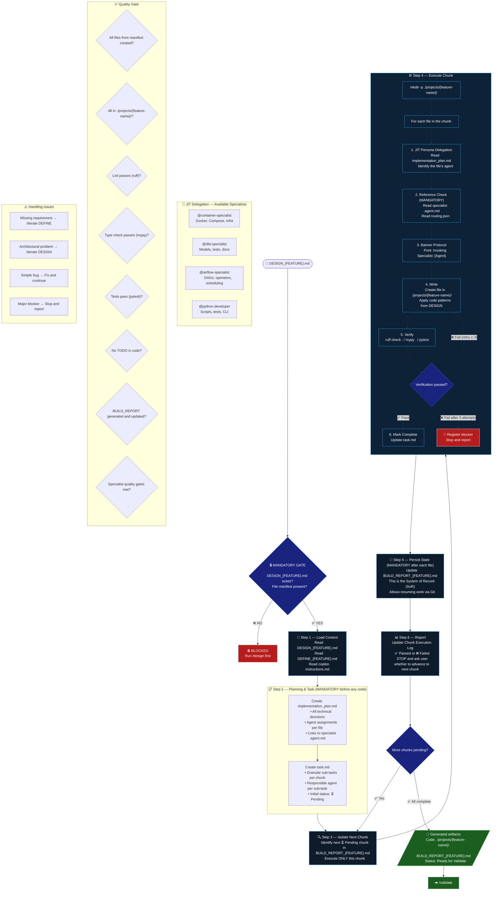

# Phase 3 — BUILD



## Quick Rules

| # | Rule |
| --- | --- |
| 1 | **HARD GATE**: without `DESIGN_{FEATURE}.md` with manifest → blocked |
| 2 | `implementation_plan.md` and `task.md` **mandatory before any code** |
| 3 | Execute **only the next pending chunk** — never the entire project at once |
| 4 | Every file goes to `./projects/{feature-name}/` — never in the root |
| 5 | `BUILD_REPORT` is the **System of Record** — update after each file |
| 6 | Verification fails → retry up to **3 times** before registering a blocker |
| 7 | Each file has a **specialist agent** defined in the implementation_plan |
| 8 | STOP after each chunk and ask the user before continuing |

## Execution Loop

```text
BUILD_REPORT (SoR)
      │
      ▼
Next chunk ⏳ Pending
      │
      ▼
For each file in the chunk:
  → JIT delegate → write → verify → persist
      │                         │
      │ ✅                      │ ❌ (retry ≤ 3)
      ▼                         ▼
  task.md updated          fix + retry
      │
      ▼
BUILD_REPORT updated → STOP → wait for user
```
