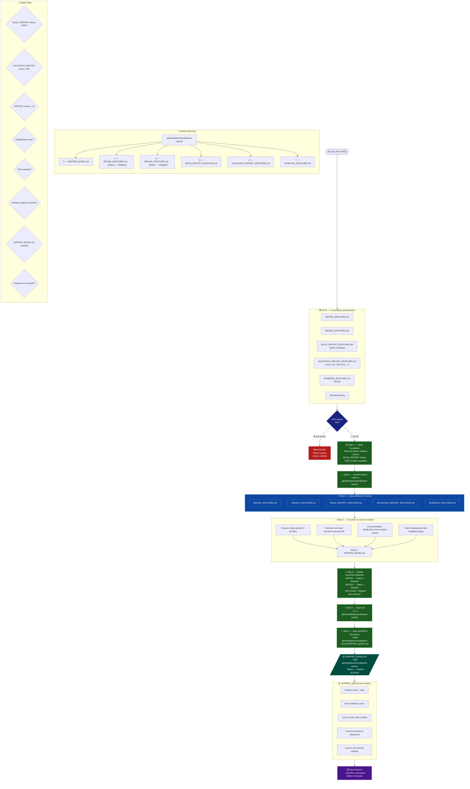

# Phase 4 — SHIP



## Quick Rules

| # | Rule |
| --- | --- |
| 1 | **6 prerequisites** — any missing → blocked |
| 2 | `VALIDATION_REPORT` with **score ≥ 90 AND CRITICAL = 0** is mandatory |
| 3 | `RUNBOOK_{FEATURE}.md` must exist (generated by /validate) |
| 4 | **Lessons learned** documented in 4 categories |
| 5 | Artifacts are **copied** to archive, not moved directly |
| 6 | DEFINE and DESIGN receive **Status: ✅ Shipped** before archiving |
| 7 | `.github/sdd/features/{feature-name}/` is **removed** after archiving |
| 8 | Code remains in `./projects/{feature-name}/` — it is not removed |

## Lessons Learned — Guide

| Category | Example entries |
| --- | --- |
| **Process** | "Breaking into smaller chunks helped" · "More checkpoints in brainstorm" |
| **Technical** | "Config via YAML > env vars" · "Specialist X was crucial for Y" |
| **Communication** | "Clarifying scope before design avoided rework" |
| **Tools** | "Library X simplified Z" · "Using KB pattern saved time" |

## Archive vs Features

```text
During development:
  .github/sdd/features/{feature-name}/   ← active artifacts

After /ship:
  .github/sdd/archive/{feature-name}/    ← permanent artifacts
  .github/sdd/features/{feature-name}/   ← REMOVED
  ./projects/{feature-name}/             ← code remains
```
