# SDD Workflow Graph — Brainstorm → Define → Design

> Complete graph with all rules, gates, and mental flow for phases 0, 1, and 2 of Spec-Driven Development.

```mermaid
flowchart TD
    %% ─── ENTRY POINT ───────────────────────────────────────────────
    START(["`**ENTRY**
    Idea / Notes / Conversation`"])

    START --> GROUNDING

    %% ─── MANDATORY GROUNDING ─────────────────────────────────────
    subgraph GROUNDING["🔍 MANDATORY GROUNDING (all phases)"]
        direction TB
        G1[Read CLAUDE.md]
        G2[Read WORKFLOW_CONTRACTS.yaml]
        G3[Check relevant skill]
        G4[Load pertinent KB domains ≤ 3 files]
        G1 --> G2 --> G3 --> G4
    end

    GROUNDING --> PHASE0

    %% ═══════════════════════════════════════════════════════════════
    %% PHASE 0 — BRAINSTORM
    %% ═══════════════════════════════════════════════════════════════
    subgraph PHASE0["⚡ PHASE 0 — BRAINSTORM  (confidence: 0.85)"]
        direction TB

        subgraph KB0["KB-FIRST RESOLUTION"]
            direction LR
            KB0A["1. KB Discovery\n(relevant domain?)"]
            KB0B["2. Codebase Exploration\n(existing patterns?)"]
            KB0C["3. Confidence Assignment\n(0.0 → 1.0)"]
            KB0D["4. MCP Validation\n(if conf < 0.85)"]
            KB0A --> KB0B --> KB0C --> KB0D
        end

        B_S1["STEP 1 — Gather Context\nRead existing BRAINSTORM?\nLoad project context"]
        B_S2["STEP 2 — Discovery Questions\n≥ 3 mandatory questions\nPrefer multiple choice\nAvoid question dump"]
        B_S3["STEP 3 — Sample Collection\nCollect: inputs, outputs,\nground truth for LLM grounding"]
        B_S4["STEP 4 — Explore Approaches\n2–3 approaches with trade-offs\nDo not present a single approach"]
        B_S5["STEP 5 — Apply YAGNI\n'Do we need this for MVP?'\nSimplification checklist"]
        B_S6["STEP 6 — Validate Incrementally\n≥ 2 validation checkpoints\nPresent progress to user"]
        B_S7["STEP 7 — Generate Document\nSave BRAINSTORM_{FEATURE}.md"]

        KB0 --> B_S1
        B_S1 --> B_S2
        B_S2 --> B_S3
        B_S3 --> B_S4
        B_S4 --> B_S5
        B_S5 --> B_S6
        B_S6 --> B_S7

        subgraph B_ANTI["🚫 Anti-Patterns (PHASE 0)"]
            direction LR
            BA1["Question dump\n(many questions at once)"]
            BA2["Assuming answers\nwithout asking"]
            BA3["Presenting\na single approach"]
            BA4["Ignoring\ntechnical constraints"]
        end

        subgraph B_GATE["✅ Quality Gate BRAINSTORM"]
            direction TB
            BG1["Problem clear and specific?"]
            BG2["Users identified?"]
            BG3["≥ 2 approaches with trade-offs?"]
            BG4["YAGNI applied?"]
            BG5["Samples collected (LLM use case)?"]
            BG6["≥ 2 checkpoints validated?"]
            BG7["Status = Ready for Define?"]
        end

        B_S7 --> B_GATE
    end

    %% Status transitions BRAINSTORM
    B_GATE --> B_STATUS{Passed quality gate?}
    B_STATUS -->|"❌ No"| B_S2
    B_STATUS -->|"✅ Yes"| B_OUTPUT

    B_OUTPUT[/"📄 BRAINSTORM_{FEATURE}.md
    Status: ✅ Complete — Ready for Define
    Path: .github/sdd/features/{feature-name}/"/]

    %% ═══════════════════════════════════════════════════════════════
    %% GATE: DEFINE can start without BRAINSTORM
    %% ═══════════════════════════════════════════════════════════════
    B_OUTPUT --> DEFINE_GATE

    DIRECT_INPUT(["Direct requirement /\nmeeting notes /\nemail thread"]) --> DEFINE_GATE

    DEFINE_GATE{"Can Define start\nwithout BRAINSTORM?"}
    DEFINE_GATE -->|"✅ Yes\n(BRAINSTORM is optional in /define)"| PHASE1
    DEFINE_GATE -->|"🔄 Normal flow"| PHASE1

    %% ═══════════════════════════════════════════════════════════════
    %% PHASE 1 — DEFINE
    %% ═══════════════════════════════════════════════════════════════
    subgraph PHASE1["📋 PHASE 1 — DEFINE  (confidence: 0.90)"]
        direction TB

        subgraph KB1["KB-FIRST RESOLUTION"]
            direction LR
            KB1A["1. KB Discovery"]
            KB1B["2. Template Loading\n(.github/sdd/templates/)"]
            KB1C["3. Confidence Assignment"]
            KB1A --> KB1B --> KB1C
        end

        D_S1["STEP 1 — Load Context\nRead BRAINSTORM (if exists)\nLoad templates"]

        D_S2["STEP 2 — Classify Input
        ┌─ brainstorm_document
        ├─ meeting_notes
        ├─ email_thread
        ├─ conversation
        ├─ direct_requirement
        └─ mixed_sources"]

        D_S3["STEP 3 — Extract Entities
        ┌─ Problem Statement
        ├─ Users (with pain points)
        ├─ Goals (MoSCoW)
        ├─ Success Criteria (testable)
        ├─ Acceptance Tests
        ├─ Constraints
        └─ Out of Scope"]

        subgraph CLARITY["📊 STEP 4 — Clarity Score (0–15)"]
            direction TB
            CS1["Problem:  0–3\n(clear, specific, actionable)"]
            CS2["Users:    0–3\n(identified + pain points)"]
            CS3["Goals:    0–3\n(measurable + MoSCoW)"]
            CS4["Success:  0–3\n(testable criteria)"]
            CS5["Scope:    0–3\n(explicit boundaries)"]
            CS_TOTAL["TOTAL: sum of 5 elements"]
            CS1 & CS2 & CS3 & CS4 & CS5 --> CS_TOTAL
        end

        CS_TOTAL --> CS_DECISION{Score?}
        CS_DECISION -->|"12–15 🟢 HIGH\n→ Proceed"| D_S5
        CS_DECISION -->|"9–11 🟡 MEDIUM\n→ Fill gaps"| D_S4
        CS_DECISION -->|"0–8 🔴 LOW\n→ Block, collect more info"| D_S4

        D_S4["STEP 5 — Fill Gaps\nFallback questions\nfor each low-score element"]
        D_S4 --> CLARITY

        D_S5["STEP 6 — Generate Document
        Mandatory sections:
        1. Problem Statement
        2. Users & Personas
        3. Goals (MoSCoW)
        4. Success Criteria
        5. Acceptance Tests
        6. Constraints
        7. Out of Scope
        8. Technical Context (location, KB, IaC)
        9. Data Engineering Context (if applicable)"]

        subgraph D_DE["🔧 Data Engineering Context (when applicable)"]
            direction LR
            DE1["Source Inventory"]
            DE2["Freshness SLAs"]
            DE3["Schema Contracts"]
            DE4["Completeness Metrics"]
            DE5["Volume Estimates"]
        end

        D_S5 --> D_DE

        subgraph D_ANTI["🚫 Anti-Patterns (PHASE 1)"]
            direction LR
            DA1["Vague language\n('improve performance')"]
            DA2["Non-testable\ncriteria"]
            DA3["Unidentified\nusers"]
            DA4["Implementation details\nin DEFINE"]
        end

        subgraph D_GATE["✅ Quality Gate DEFINE"]
            direction TB
            DG1["Clarity Score ≥ 12/15?"]
            DG2["All users identified?"]
            DG3["Testable success criteria?"]
            DG4["MoSCoW applied?"]
            DG5["Explicit scope (in/out)?"]
            DG6["Acceptance Tests written?"]
            DG7["Tech context mapped?"]
            DG8["Data context (if DE) included?"]
            DG9["Status = Ready for Design?"]
        end

        KB1 --> D_S1
        D_S1 --> D_S2 --> D_S3 --> CLARITY
        D_DE --> D_GATE
    end

    DEFINE_GATE --> PHASE1

    D_GATE --> D_STATUS{Passed quality gate?}
    D_STATUS -->|"❌ No (score < 12)"| D_S4
    D_STATUS -->|"✅ Yes"| D_OUTPUT

    D_OUTPUT[/"📄 DEFINE_{FEATURE}.md
    Status: ✅ Complete — Ready for Design
    Path: .github/sdd/features/{feature-name}/
    Clarity Score: NN/15"/]

    %% ═══════════════════════════════════════════════════════════════
    %% MANDATORY GATE: DEFINE → DESIGN
    %% ═══════════════════════════════════════════════════════════════
    D_OUTPUT --> DESIGN_MANDATORY_GATE

    DESIGN_MANDATORY_GATE{"🔒 MANDATORY GATE
    DEFINE_{FEATURE}.md exists?"}
    DESIGN_MANDATORY_GATE -->|"❌ NO — BLOCKED"| BLOCK_DESIGN["⛔ /design BLOCKED
    Run /define first"]
    DESIGN_MANDATORY_GATE -->|"✅ YES — Proceed"| PHASE2

    %% ═══════════════════════════════════════════════════════════════
    %% PHASE 2 — DESIGN
    %% ═══════════════════════════════════════════════════════════════
    subgraph PHASE2["🏗️ PHASE 2 — DESIGN  (confidence: 0.95)"]
        direction TB

        subgraph KB2["KB-FIRST RESOLUTION"]
            direction LR
            KB2A["1. KB Pattern Loading\n(relevant patterns)"]
            KB2B["2. Agent Discovery\n(routing.json)"]
            KB2C["3. Confidence Assignment"]
            KB2D["4. MCP Validation\n(if conf < 0.95)"]
            KB2A --> KB2B --> KB2C --> KB2D
        end

        DS_S1["STEP 1 — Load Context\nRead DEFINE_{FEATURE}.md\nLoad KB domains\nCheck routing.json"]

        DS_S2["STEP 2 — Create Architecture
        ┌─ Mandatory ASCII diagram
        ├─ Component decisions
        ├─ Integration strategy
        └─ Justified technology stack"]

        subgraph ADR["📝 STEP 3 — Inline ADR (per decision)"]
            direction TB
            ADR1["Status: Proposed | Accepted | Deprecated | Superseded"]
            ADR2["Date: YYYY-MM-DD"]
            ADR3["Context: situation forcing the decision"]
            ADR4["Choice: decision made"]
            ADR5["Rationale: why this choice"]
            ADR6["Alternatives Rejected: what was discarded"]
            ADR7["Consequences: impacts and trade-offs"]
        end

        DS_S3["STEP 4 — File Manifest
        Table: # | file_path | action | purpose | dependencies
        Actions: CREATE | MODIFY | DELETE | READ
        All dependencies mapped"]

        subgraph AGENT_MATCH["🤖 STEP 5 — Agent Matching"]
            direction TB
            AM1["File Type → weight HIGH"]
            AM2["Purpose Keywords → weight HIGH"]
            AM3["Path Patterns → weight MEDIUM"]
            AM4["KB Domain → weight MEDIUM"]
            AM_RESULT["Assign specialist agent\nper file/component"]
            AM1 & AM2 & AM3 & AM4 --> AM_RESULT
        end

        DS_S4["STEP 6 — Code Patterns
        Copy-paste ready snippets\nBased on KB patterns\nPer file/component type"]

        DS_S5["STEP 7 — Testing Strategy
        ┌─ Unit Tests: isolated logic
        ├─ Integration Tests: contracts between components
        └─ E2E Tests: end-to-end flow"]

        subgraph PIPELINE_ARCH["🔄 Pipeline Architecture (when DE)"]
            direction LR
            PA1["DAG Diagram"]
            PA2["Partition Strategy"]
            PA3["Incremental Strategy"]
            PA4["Schema Evolution"]
        end

        subgraph DESIGN_PRINCIPLES["📐 Design Principles"]
            direction LR
            DP1["Self-Contained\n(no unnecessary external deps)"]
            DP2["Config Over Code\n(behavior via config)"]
            DP3["KB Patterns\n(reuse validated patterns)"]
            DP4["Agent Specialization\n(delegate to the right agent)"]
            DP5["Testable\n(design facilitates testing)"]
        end

        subgraph DS_ANTI["🚫 Anti-Patterns (PHASE 2)"]
            direction LR
            DSA1["Architecture without\nASCII diagram"]
            DSA2["Decision without ADR\n(undocumented)"]
            DSA3["Incomplete\nfile manifest"]
            DSA4["Over-engineering\n(YAGNI violated)"]
        end

        subgraph DS_GATE["✅ Quality Gate DESIGN"]
            direction TB
            DSG1["Architecture diagram present?"]
            DSG2["ADR for each critical decision?"]
            DSG3["Complete file manifest?"]
            DSG4["Agent matching defined?"]
            DSG5["Code patterns copy-paste ready?"]
            DSG6["Testing strategy defined (U/I/E2E)?"]
            DSG7["Pipeline arch (if DE) documented?"]
            DSG8["Design principles respected?"]
            DSG9["Status = Ready for Build?"]
        end

        KB2 --> DS_S1
        DS_S1 --> DS_S2 --> ADR --> DS_S3
        DS_S3 --> AGENT_MATCH --> DS_S4 --> DS_S5
        DS_S5 --> PIPELINE_ARCH
        PIPELINE_ARCH --> DESIGN_PRINCIPLES
        DESIGN_PRINCIPLES --> DS_GATE
    end

    DESIGN_MANDATORY_GATE -->|"✅ YES"| PHASE2

    DS_GATE --> DS_STATUS{Passed quality gate?}
    DS_STATUS -->|"❌ No"| DS_S2
    DS_STATUS -->|"✅ Yes"| DS_OUTPUT

    DS_OUTPUT[/"📄 DESIGN_{FEATURE}.md
    Status: ✅ Complete — Ready for Build
    Path: .github/sdd/features/{feature-name}/
    Contains: Architecture + ADRs + Manifest + Patterns + Tests"/]

    DS_OUTPUT --> NEXT_PHASES

    NEXT_PHASES{"/build (Phase 3)\nor /iterate (Cross-Phase)"}

    %% ═══════════════════════════════════════════════════════════════
    %% ITERATE — CROSS-PHASE
    %% ═══════════════════════════════════════════════════════════════
    subgraph ITERATE["🔄 /iterate — Cross-Phase Update"]
        direction TB
        IT1["Detect change type:
        Additive (low impact)
        Modifying (medium)
        Removing (medium)
        Architectural (high)"]

        IT2["Scale rule:
        < 30% change → /iterate
        > 50% change → new /define"]

        IT3["Cascade Rules:
        BRAINSTORM changed →
          review DEFINE (approach, users, constraints)
        DEFINE changed →
          review DESIGN (components, decisions, manifest)
        DESIGN changed →
          code needs refactoring"]

        IT1 --> IT2 --> IT3
    end

    B_OUTPUT -.->|"change post-brainstorm"| ITERATE
    D_OUTPUT -.->|"change post-define"| ITERATE
    DS_OUTPUT -.->|"change post-design"| ITERATE
    ITERATE -.->|"updates previous phase"| PHASE0
    ITERATE -.->|"updates previous phase"| PHASE1
    ITERATE -.->|"updates previous phase"| PHASE2

    %% ═══════════════════════════════════════════════════════════════
    %% NAMING CONVENTIONS
    %% ═══════════════════════════════════════════════════════════════
    subgraph NAMING["📁 Naming Conventions"]
        direction LR
        N1["Feature: SCREAMING_SNAKE_CASE\nex: USER_NOTIFICATIONS"]
        N2["Directory: kebab-case\nex: user-notifications"]
        N3["Files:\nBRAINSTORM_{FEATURE}.md\nDEFINE_{FEATURE}.md\nDESIGN_{FEATURE}.md"]
    end

    %% ─── STYLING ────────────────────────────────────────────────────
    classDef phase0 fill:#1a1a2e,stroke:#e94560,color:#fff,stroke-width:2px
    classDef phase1 fill:#16213e,stroke:#0f3460,color:#fff,stroke-width:2px
    classDef phase2 fill:#0f3460,stroke:#533483,color:#fff,stroke-width:2px
    classDef gate fill:#e94560,stroke:#fff,color:#fff,stroke-width:2px
    classDef output fill:#533483,stroke:#e94560,color:#fff,stroke-width:2px
    classDef block fill:#c0392b,stroke:#fff,color:#fff,stroke-width:2px
    classDef grounding fill:#27ae60,stroke:#fff,color:#fff,stroke-width:2px
    classDef iterate fill:#e67e22,stroke:#fff,color:#fff,stroke-width:2px

    class PHASE0 phase0
    class PHASE1 phase1
    class PHASE2 phase2
    class DESIGN_MANDATORY_GATE,B_STATUS,D_STATUS,DS_STATUS gate
    class B_OUTPUT,D_OUTPUT,DS_OUTPUT output
    class BLOCK_DESIGN block
    class GROUNDING grounding
    class ITERATE iterate
```



---

## Summary of Critical Rules

| Rule | Detail |
| --- | --- |
| **Mandatory GROUNDING** | CLAUDE.md + WORKFLOW_CONTRACTS.yaml before any phase |
| **/define without /brainstorm** | Allowed — brainstorm is optional |
| **/design without /define** | **BLOCKED** — DEFINE_{FEATURE}.md is mandatory |
| **Minimum Clarity Score** | 12/15 to exit /define |
| **Confidence thresholds** | Brainstorm 0.85 · Define 0.90 · Design 0.95 |
| **YAGNI** | Applied in brainstorm and respected in design |
| **Mandatory ADR** | Every architectural decision needs an inline ADR (7 elements) |
| **File manifest** | Complete table: path · action · purpose · dependencies |
| **Agent matching** | File → specialist agent via routing.json |
| **/iterate threshold** | < 30% → iterate · > 50% → new /define |
| **Cascade** | Change in a previous phase propagates to subsequent phases |

## Artifact Paths

```text
.github/sdd/features/{feature-name}/
├── BRAINSTORM_{FEATURE}.md     ← Phase 0
├── DEFINE_{FEATURE}.md         ← Phase 1
├── DESIGN_{FEATURE}.md         ← Phase 2
├── BUILD_REPORT_{FEATURE}.md   ← Phase 3
├── VALIDATION_REPORT_{FEATURE}.md ← Phase 3.5
└── RUNBOOK_{FEATURE}.md        ← Phase 3.5 (if approved)
```
